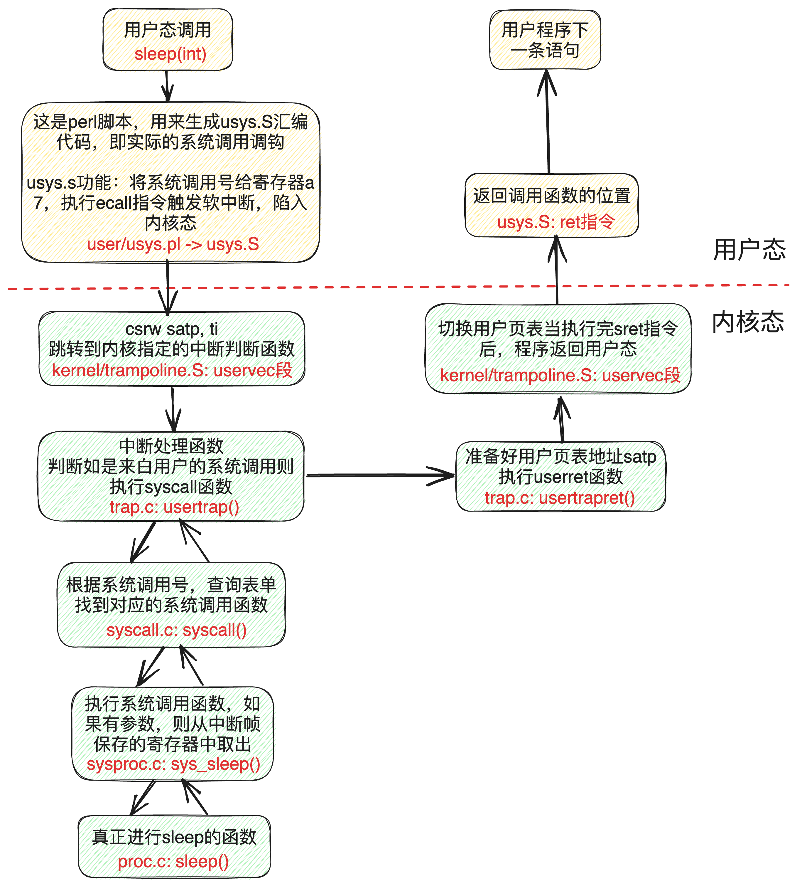
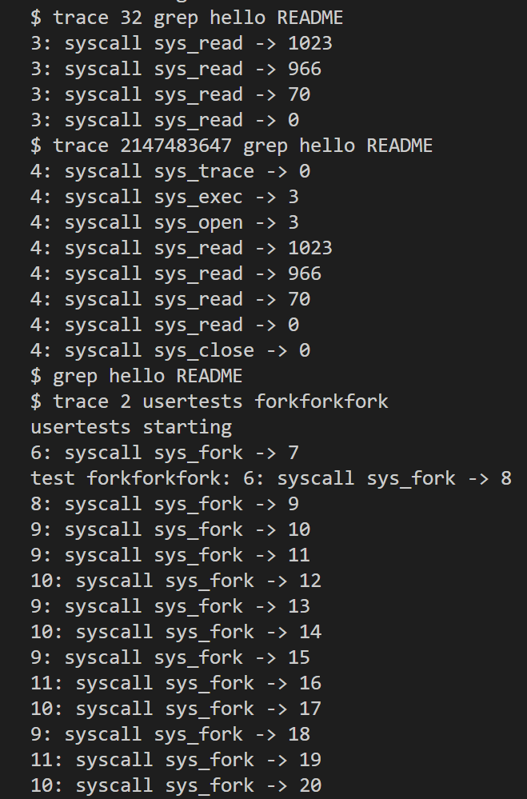
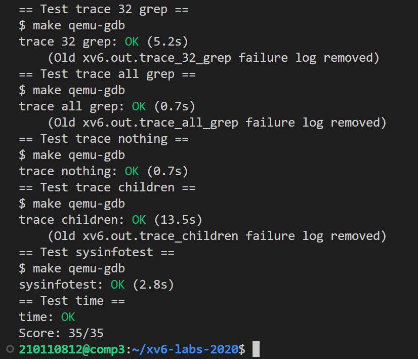

# LAB2: system calls

本实验为哈工大（深圳）操作系统课内第二次实验，要求与mit-6.S081完全不同，详见[实验指导书](http://hitsz-cslab.gitee.io/os-labs/lab2/part1/)。在此我仅介绍mit-6.S081中的任务，课内实验任务详见实验报告

> To start the lab, switch to the syscall branch
>
> ```c
> $ git fetch
> $ git checkout syscall
> $ make clean
> ```

系统调用的实现的整体流程：



## System call tracing (moderate)

任务：添加一个系统调用 `trace(int mask)`，mask 是一个二进制掩码，其每一位代表是否跟踪那一位表示的系统调用。如果某一种系统调用被跟踪了，那么在它将要返回的时候，输出一行 `<pid>: systemcall <syscall name> -> <return value>`。trace 能跟踪的进程包括调用它的那个进程，以及该进程所 fork 的子进程、子进程所 fork 的子子进程。

> **系统调用全流程：**
>
> - user/user.h：用户态程序调用跳板函数 trace() 
>
> - user/usys.S：跳板函数 trace() 使用 CPU 提供的 ecall 指令，调用到内核态 
>
> - kernel/syscall.c：到达内核态统一系统调用处理函数 syscall()，所有系统调用都会跳到这里来处理。 
>
> - kernel/syscall.c：syscall() 根据跳板传进来的系统调用编号，查询syscalls[]表，找到对应的内核函数并调用。 
>
> - kernel/sysproc.c：到达 sys_trace() 函数，执行具体内核操作

系统调用的编号定义在 kernel/syscall.h 中，如下所示：

```c
// System call numbers
#define SYS_fork    1
#define SYS_exit    2
#define SYS_wait    3
#define SYS_pipe    4
#define SYS_read    5
#define SYS_kill    6
#define SYS_exec    7
#define SYS_fstat   8
#define SYS_chdir   9
#define SYS_dup    10
#define SYS_getpid 11
#define SYS_sbrk   12
#define SYS_sleep  13
#define SYS_uptime 14
#define SYS_open   15
#define SYS_write  16
#define SYS_mknod  17
#define SYS_unlink 18
#define SYS_link   19
#define SYS_mkdir  20
#define SYS_close  21
#define SYS_trace  22
```

编号对应到的系统调用函数指针储存在 kernel/syscall.c 中，如下所示：

```c
static uint64 (*syscalls[])(void) = {
[SYS_fork]    sys_fork,
[SYS_exit]    sys_exit,
[SYS_wait]    sys_wait,
[SYS_pipe]    sys_pipe,
[SYS_read]    sys_read,
[SYS_kill]    sys_kill,
[SYS_exec]    sys_exec,
[SYS_fstat]   sys_fstat,
[SYS_chdir]   sys_chdir,
[SYS_dup]     sys_dup,
[SYS_getpid]  sys_getpid,
[SYS_sbrk]    sys_sbrk,
[SYS_sleep]   sys_sleep,
[SYS_uptime]  sys_uptime,
[SYS_open]    sys_open,
[SYS_write]   sys_write,
[SYS_mknod]   sys_mknod,
[SYS_unlink]  sys_unlink,
[SYS_link]    sys_link,
[SYS_mkdir]   sys_mkdir,
[SYS_close]   sys_close,
[SYS_trace]   sys_trace, 
};
```

下面我们来实现该任务：

1. 由于`trace` 的功能是针对进程而言的，可以视作进程的一个属性。因此，我们在kernel/proc.h文件中的`proc `结构体（即 PCB） 中添加 `mask`字段，用于表示当前进程的哪些系统调用被跟踪了：

   ```c
   struct proc {
     ...
     int mask;                    
     ...
   };
   ```

2. 修改 kernel/proc.c文件中的 `fork`函数 ，以复制从父进程到子进程的跟踪掩码

   ```c
   int
   fork(void)
   {
     ...
     np->mask = p->mask;
     ...
   }
   ```

3. 在 kernel/sysproc.c 中，实现系统调用`sys_trace`的具体代码：通过`argint`函数读取参数，然后设置给进程的`mask`字段。

   ```c
   uint64
   sys_trace(void)
   {
     int n;
     if(argint(0, &n) < 0)
       return -1;
     myproc()->mask = n;
     return 0;
   }
   ```

4. 最后，修改kernel/syscall.c文件中`syscall()`函数，打印相关信息。

   ```c
   // 存储每个编号对应的系统调用的名称
   static char *syscalls_name[] = {
   [SYS_fork]    "fork",
   [SYS_exit]    "exit",
   [SYS_wait]    "wait",
   [SYS_pipe]    "pipe",
   [SYS_read]    "read",
   [SYS_kill]    "kill",
   [SYS_exec]    "exec",
   [SYS_fstat]   "fstat",
   [SYS_chdir]   "chdir",
   [SYS_dup]     "dup",
   [SYS_getpid]  "getpid",
   [SYS_sbrk]    "sbrk",
   [SYS_sleep]   "sleep",
   [SYS_uptime]  "uptime",
   [SYS_open]    "open",
   [SYS_write]   "write",
   [SYS_mknod]   "mknod",
   [SYS_unlink]  "unlink",
   [SYS_link]    "link",
   [SYS_mkdir]   "mkdir",
   [SYS_close]   "close",
   [SYS_trace]   "trace",
   [SYS_sysinfo] "sysinfo",
   };
   
   void
   syscall(void)
   {
     int num;
     struct proc *p = myproc();
   
     num = p->trapframe->a7;
     if(num > 0 && num < NELEM(syscalls) && syscalls[num]) {
       p->trapframe->a0 = syscalls[num]();
       
       // 打印信息
       if((p->mask >> num) & 1)
         printf("%d: syscall %s -> %d\n", p->pid, syscalls_name[num], p->trapframe->a0);
   
     } else {
       printf("%d %s: unknown sys call %d\n",
               p->pid, p->name, num);
       p->trapframe->a0 = -1;
     }
   }
   ```

5. kernel/syscall.h、user/user.h、user/usys.pl、kernel/syscall.c等文件的修改不再赘述。


测试结果截图：



## Sysinfo (moderate)

任务：添加一个系统调用 `sysinfo `用于收集系统信息，它接受一个指向`struct sysinfo`（见 kernel/sysinfo.h）的指针，内核需要填上这个结构体的两个元素：freemem 表示空闲内存的字节数，nproc 表示 state 不是 UNUSED 的进程的数量。

1. 实现`sys_sysinfo`系统调用

   > 关于`copyout`函数：
   >
   > - 我们传入的参数是一个指向的是用户空间的虚拟内存的指针，但是 xv6 系统内核中的页表和用户空间中的页表并不一致，所以我们无法直接用这个指针。为此，我们需要使用 copyout() 函数，将内核态的sysinfo结构体结合进程的页表 p->pagetable，写到进程内存空间内的info指针指向的地址处。

   ```c
   uint64
   sys_sysinfo(void)
   {
     uint64 info;
     struct sysinfo sysinfo;
     struct proc *p = myproc();
     if(argaddr(0, &info) < 0){
       return -1;
     }
   
     sysinfo.freemem = count_freemem();
     sysinfo.nproc = count_nproc();
     if(copyout(p->pagetable, info, (char*)&sysinfo, sizeof(sysinfo)) < 0){
       return -1;
     }
     return 0;
   }
   ```

2. 在kernel/kalloc.c中实现`count_freemem`函数收集空闲内存的字节数。由于空闲的内存页面构成一个链表` kmem.freelist`，因此只要遍历链表，计算其长度并乘以一页的字节数即可。

   ```c
   uint64 
   count_freemem(void) 
   {
     struct run *r = kmem.freelist;
     uint64 count = 0;
   
     acquire(&kmem.lock);
     while(r){
       r = r->next;
       count += PGSIZE;
     }
     release(&kmem.lock);
     return count;
   }
   ```

3. 在kernel/proc.c 中实现`count_nproc`函数收集状态不是 UNUSED 的进程数。只需遍历所有进程的PCB，统计不处于 UNUSED 状态的进程数目即可。

   ```c
   uint64
   count_nproc(void)
   {
     uint64 count = 0;
     struct proc *p;
     // 遍历所有进程的PCB
     for(p = proc; p < &proc[NPROC]; p++) {
       acquire(&p->lock);
       if(p->state != UNUSED)
         count++;
       release(&p->lock);
     }
   
     return count;
   }
   ```

4. kernel/syscall.h、user/user.h、user/usys.pl、kernel/syscall.c等文件的修改不再赘述。

# 结果截图

