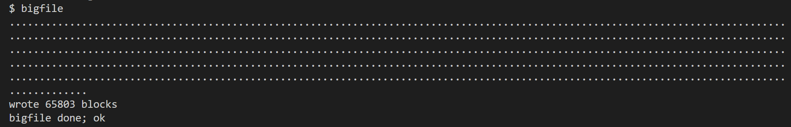
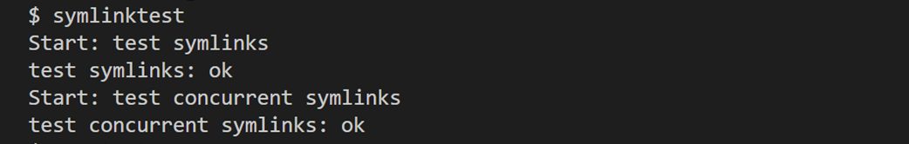
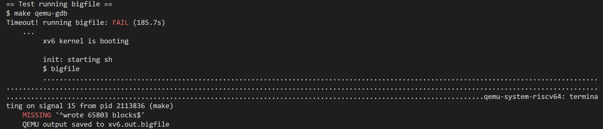
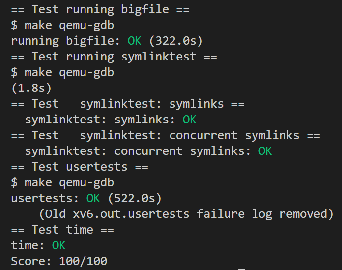

# LAB9: File System

> To start the lab, switch to the fs branch
>
> ```c
> $ git fetch
> $ git checkout fs
> $ make clean
> ```

:star: 由于LAB9是我在写完课内操作系统实验“基于FUSE架构的青春版EXT2文件系统”后所写，因此相对来说比较简单。

## Large files (moderate)

在 xv6 原有的文件系统中，采用了**混合索引**的方式记录数据的所在具体盘块号。inode 结构体中包括了 **12 个直接索引节点**（direct block number ）和 **1 个一级索引节点**（indirect block number）。由于一个一级索引节点可以包含 BSIZE(1024)/4=256 个块号，所以一个文件最多占据 256+12=268 个磁盘块，即 268KB。但这显然太小了，所以我们希望通过**二级索引节点**（doubly-indirect block） 增大它，且这个二级索引节点为一个直接索引节点修改而成。这样，由于一个二级索引节点可以包含 256\*256 个块，所以文件系统就可以支持 11+256+256*256=65803 个块，即 65803KB。 

1. 修改 kernel/fs.h 中的直接索引节点个数、单个文件支持的最大磁盘块数以及 struct dinode（磁盘上的 inode 结构体），具体操作为：将 NDIRECT 直接索引的盘块号减少 1，腾出 inode 中的空间来存储二级索引的索引表盘块号。

   ```c
   #define NDIRECT 11                        // 直接索引节点个数
   #define NINDIRECT (BSIZE / sizeof(uint))  // 一级索引节点可以指向的磁盘块个数
   #define MAXFILE (NDIRECT + NINDIRECT + NINDIRECT * NINDIRECT)   //单个文件最多可以占据的磁盘块数
   
   // On-disk inode structure
   struct dinode {
     short type;           // File type
     short major;          // Major device number (T_DEVICE only)
     short minor;          // Minor device number (T_DEVICE only)
     short nlink;          // Number of links to inode in file system
     uint size;            // Size of file (bytes)
     uint addrs[NDIRECT+2];   // Data block addresses
   };
   ```

   同理，修改 kernel/file.h 中的 struct inode（内存中的 inode 副本结构体）

   ```c
   // in-memory copy of an inode
   struct inode {
     uint dev;           // Device number
     uint inum;          // Inode number
     int ref;            // Reference count
     struct sleeplock lock; // protects everything below here
     int valid;          // inode has been read from disk?
   
     short type;         // copy of disk inode
     short major;
     short minor;
     short nlink;
     uint size;
     uint addrs[NDIRECT+2];    // NDIRECT+1 -> NDIRECT+2
   };
   ```

2. 修改 kernel/fs.c中的`bmap`函数（获取 inode 中第 bn 个块的块号），增加查找二级索引对应的数据块的代码。实现的逻辑很简单：进行三层查找，首先判断二级索引节点是否存在，若不存在则调用 balloc 函数进行分配。然后读取二级索引节点指向的地址，判断次级目录项是否存在，若不存在则调用 balloc 函数进行分配。最后读取次级目录项指向的地址，判断bn对应的数据块是否存在，若不存在则调用 balloc 函数进行分配。最终返回分配的块地址 `addr`。

   ```c
   static uint
   bmap(struct inode *ip, uint bn)
   {
     uint addr, *a;
     struct buf *bp;
   
     if(bn < NDIRECT){
       ......
     }
     bn -= NDIRECT;
   
     if(bn < NINDIRECT){
       ......
     }
     bn -= NINDIRECT;
   
     // 查找二级索引
     if(bn < NINDIRECT * NINDIRECT){
       // 如果二级索引块还未分配
       if((addr = ip->addrs[NDIRECT+1]) == 0)
         ip->addrs[NDIRECT+1] = addr = balloc(ip->dev);
       // 读取二级索引块数据到缓冲区中
       bp = bread(ip->dev, addr);
       a = (uint*)bp->data;
   
       // 判断次级目录项是否存在
       if((addr = a[bn / NINDIRECT]) == 0){
         a[bn / NINDIRECT] = addr = balloc(ip->dev);
         log_write(bp);
       }
       brelse(bp);
       // 读取次级索引块数据到缓冲区中
       bp = bread(ip->dev, addr);
       a = (uint*)bp->data;
   
       // 判断bn对应的数据块是否存在
       if((addr = a[bn % NINDIRECT]) == 0){
         a[bn % NINDIRECT] = addr = balloc(ip->dev);
         log_write(bp);
       }
   
       // 释放缓冲区
       brelse(bp);
       return addr;
     }
   
     panic("bmap: out of range");
   }
   ```

3. 修改 kernel/fs.c中的`itrunc`函数（释放该 inode 所使用的所有数据块），增加查找二级索引对应的数据块的代码。实现逻辑同`bmap`函数一致，即进行三层释放，在此不再赘述。

   ```c
   void
   itrunc(struct inode *ip)
   {
     int i, j;
     struct buf *bp;
     struct buf *bp2;
     uint *a;
     uint *a2;
       
     ......
   
     if(ip->addrs[NDIRECT]){
       ......
     }
   
     if(ip->addrs[NDIRECT+1]){
       bp = bread(ip->dev, ip->addrs[NDIRECT+1]);
       a = (uint*)bp->data;
       for(j = 0; j < NINDIRECT; j++){
         if(a[j]){
           bp2 = bread(ip->dev, a[j]);
           a2 = (uint*)bp2->data;
           for(int k = 0; k < NINDIRECT; k++){
             if(a2[k])
               bfree(ip->dev, a2[k]);
           }
           brelse(bp2);
           bfree(ip->dev, a[j]);
           a[j] = 0;
         }
       }
       brelse(bp);
       bfree(ip->dev, ip->addrs[NDIRECT+1]);
       ip->addrs[NDIRECT+1] = 0;
     }
     ip->size = 0;
     iupdate(ip);
   }
   ```

测试结果如下：



## Symbolic links (moderate)

任务：在 xv6 中实现**符号链接机制**，使得能够按照路径名引用链接的文件。为此，需要实现 `symlink(char *target, char *path)` 的系统调用，它在 `path` 处创建一个到文件名为 `target` 的软链接。

> 关于**硬链接**和**软链接**：
>
> - 硬链接：
>
>   linux下的文件是通过索引节点（Inode）来识别的，硬链接可以认为是一个指针，指向文件索引节点的指针，但系统并不为它重新分配inode。每添加一个一个硬链接，文件的链接数就加1。硬连接之间没有主次之分，删除某个硬链接，只是将其从目录的数据块中删除相关信息，并且文件链接数减一，并不会从inode表中删除inode，除非只剩下一个链接数。
>
> - 软链接：
>
>   又称符号链接，可以理解为 Windows 下的快捷方式，它本身也是一个文件，但是指向另一个文件。当打开一个软链接文件时，如果打开模式没有设置 `O_NOFOLLOW`，就会打开链接到的文件——如果链接到的文件也是一个软链接，则继续往下找。

1. 将新文件类型 `T_SYMLINK`添加到 kernel/stat.h ，表示符号链接：

   ```c
   #define T_DIR     1   // Directory
   #define T_FILE    2   // File
   #define T_DEVICE  3   // Device
   #define T_SYMLINK 4   // Symlink
   ```

2. 在 kernel/fcntl.h 中补齐` O_NOFOLLOW `的定义。此处需要注意：传递给 `open` 的标志是使用按位 OR 运算符组合的，因此新标志不应与任何现有标志重叠，故我们将值选定为`0x800`。

   ```c
   #define O_NOFOLLOW   0x800
   ```

3. 实现 kernel/sysfile.c 中实现 symlink 系统调用，用于创建符号链接。 符号链接就是在文件中保存指向文件的路径名，在打开文件的时候根据保存的路径名查找实际文件。其实现逻辑主要为：创建一个`inode`，设置其类型为`T_SYMLINK`，然后向这个`inode`中写入目标文件的路径即可。

   ```c
   uint64
   sys_symlink(void)
   {
     // 获取参数
     char target[MAXPATH], path[MAXPATH];
     if(argstr(0, target, MAXPATH) < 0 || argstr(1, path, MAXPATH) < 0)
       return -1;
   
     struct inode *ip;
     begin_op();   // 开启文件系统操作
   
     //创建一个inode，设置其类型为T_SYMLINK
     if((ip = create(path, T_SYMLINK, 0, 0)) == 0){
       end_op();
       return -1;
     }
   
     // 将目标路径 target 写入到新创建的符号链接文件中
     if(writei(ip, 0, (uint64)target, 0, MAXPATH) != MAXPATH){
       end_op();
       return -1;
     }
     
     iunlockput(ip);
     end_op();   // 结束文件系统操作
     return 0;
   }
   ```

4. 在 user/usys.pl 中添加该系统调用的 entry

   ```c
   entry("symlink");
   ```

   在 user/user.h 中添加函数声明

   ```c
   int symlink(char *, char *);
   ```

   在 kernel/syscall.h 中添加系统调用号

   ```c
   #define SYS_symlink  22
   ```

   在 kernel/syscall.c 中添加系统调用的声明和系统调用号到对应系统调用的映射

   ```c
   extern uint64 sys_symlink(void);
   
   [SYS_symlink] sys_symlink,
   ```

5. 最后，在`sys_open`中添加对符号链接的处理，当模式不是`O_NOFOLLOW`时对符号链接进行循环处理，直到找到真正的文件。和 `writei()` 对应的，用 `readi()` 读取文件的数据块即可得到链接地址。如果循环超过了一定的次数（10），则说明可能发生了循环链接，返回-1。

   > 需要注意的是：`namei`函数不会对`ip`上锁，需要使用`ilock`来上锁，而`create`函数则会上锁。

   ```c
   uint64
   sys_open(void)
   {
     ......
     begin_op();
   
     if(omode & O_CREATE){
       ......
     } else {
       int depth;  
       for(depth = 0; depth < 10; depth++) {
         // 查找path对应的inode
         if((ip = namei(path)) == 0){ 
           end_op();
           return -1;
         }
         ilock(ip);
         if(ip->type == T_DIR && omode != O_RDONLY){
           iunlockput(ip);
           end_op();
           return -1;
         }
         // 如果是符号链接，则循环处理，直到找到真正的文件为止
         if(ip->type == T_SYMLINK && (omode & O_NOFOLLOW) == 0) {
           if(readi(ip, 0, (uint64)path, 0, MAXPATH) < 0) {
             iunlockput(ip);
             end_op();
             return -1;
           }
         } else {
           break;
         }
         iunlockput(ip);
       }
       // 循环超过了一定的次数，可能发生了循环链接，返回-1
       if(depth == 10) {  
          end_op();
          return -1;
       }
     }
   
     ......
   }
   ```

测试结果如下：



# 结果截图

:warning: 注意！由于大文件需要运行的时间较长，所以需要延长 grade-lab-fs 中 timeout 的时间，不然就会......（下图是本人亲自示范的错误测试....哭）



测试通过截图：

