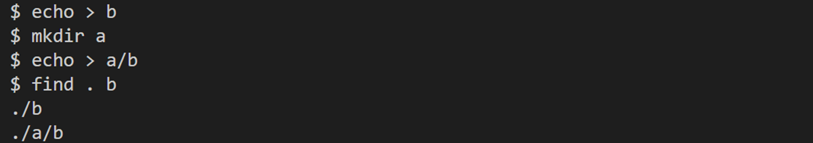
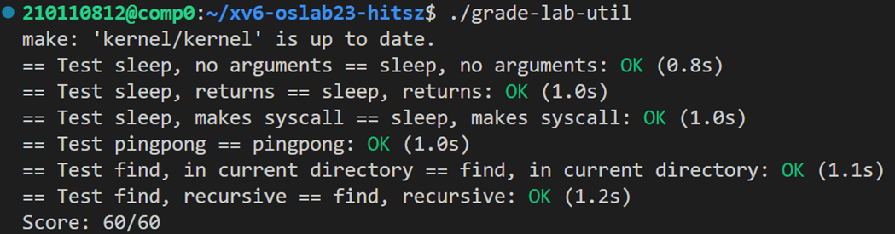

# LAB1: Xv6 and Unix utilities

本实验为哈工大（深圳）操作系统课内第一次实验，要求相比于mit-6.S081略有更改，详见[实验指导书](http://hitsz-cslab.gitee.io/os-labs/lab1/part1/)。

> To start the lab, switch to the util branch
>
> ```c
> $ git fetch
> $ git checkout util
> $ make clean
> ```

## sleep (easy)

任务：等待用户指定的时间（1ticks由内核定义），将代码写在user/sleep.c文件中。

## PingPong

任务：在user/pingpong.c文件中实现`pingpong`程序，即**两个进程在管道两侧来回通信**。父进程将”ping”写入管道，子进程从管道将其读出并打印`<pid>: received ping` ，其中`<pid>`是子进程的进程ID。子进程从父进程收到字符串后，将”pong“写入另一个管道，然后由父进程从该管道读取并打印`<pid>: received pong`，其中`<pid>`是父进程的进程ID。

具体实现详见实验报告。

结果截图如下：


##  find

任务：**在目录树中查找名称与字符串匹配的所有文件，输出文件的相对路径**。这个任务需要参考` ls.c `的实现，并在` ls.c `的基础上略作更改：在搜索到文件时判断是否与要找的文件名相同，相同则输出 path；在搜索到目录时递归调用 find 函数。

具体实现详见实验报告。

结果截图如下：



# 结果截图



