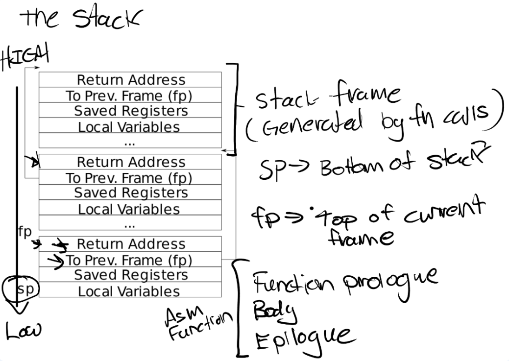
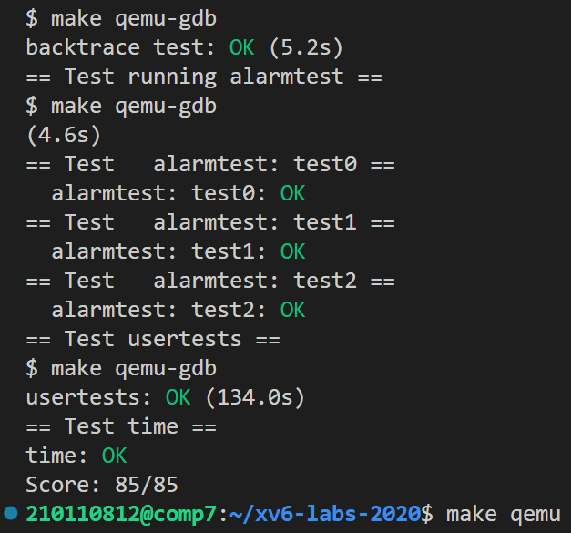

# LAB4：traps

> To start the lab, switch to the trap branch
>
> ```
> $ git fetch
> $ git checkout traps
> $ make clean
> ```

**什么是trap（陷阱）？**

- Trap是由用户程序触发的操作系统**用户态与内核态的切换**。Trap与interrupt（中断）不同，中断主要是由硬件触发，是由外部事件导致的。

- 总体来说，导致用户态与内核态发生切换有如下三种情况：

  - 系统调用（system call）
  - Page fault（缺页），运算时除以0的错误等
  - 一个设备触发了中断使得当前程序运行需要响应内核设备驱动

  **在上述情况中，1和2都属于trap的范畴，仅3属于trap的范畴。**

## RISC-V assembly (easy)

> There is a file `user/call.c` in your xv6 repo. `make fs.img` compiles it and also produces a readable assembly version of the program in `user/call.asm`.

1. Which registers contain arguments to functions? For example, which register holds 13 in main's call to `printf`?

   根据risc-v的手册, `a0-a7`都是可以存放函数调用的参数的。查看user/call.asm 文件可知：13被放在了a2寄存器中。

2. Where is the call to function `f` in the assembly code for main? Where is the call to `g`? (Hint: the compiler may inline functions.)

   刚刚我们已经看到，`li a,12` 直接把 `f(8)+1` 算出来了，所以是编译器内联了它；另外，`f` 函数里面的指令和 `g` 一模一样，说明编译器也内联了它。

3. At what address is the function `printf` located?

   0000000000000628

4. What value is in the register `ra` just after the `jalr` to `printf` in `main`?

   `jalr` 会将 pc+4 存储给指定的寄存器，反汇编语句里省略了指定寄存器，是因为默认给 ra，所以 ra=`0x38`。

5. Run the following code.

   ```c
   unsigned int i = 0x00646c72;
   printf("H%x Wo%s", 57616, &i);
   ```

   What is the output? [Here's an ASCII table](http://web.cs.mun.ca/~michael/c/ascii-table.html) that maps bytes to characters.

   The output depends on that fact that the RISC-V is little-endian. If the RISC-V were instead big-endian what would you set `i` to in order to yield the same output? Would you need to change `57616` to a different value?

   [Here's a description of little- and big-endian](http://www.webopedia.com/TERM/b/big_endian.html) and [a more whimsical description](http://www.networksorcery.com/enp/ien/ien137.txt).

   - `%x` 是按 16 进制输出，`57616=0xe110`，所以输出的前半段是 `He110`；

     ASCII 码中 0x64 对应 `d`，0x6c 对应 `l`，0x72 对应 `r`，又 RISC-V 小端存储（低地址存 0x72），且 `%s` 从低地址开始读取数据输出，所以会输出 `rld`，于是输出的后半段就是 `World`。

   - 如果是大端存储，那么 `i=0x726c6400`；但 `57616` 不用改动。

6. In the following code, what is going to be printed after `'y='`? (note: the answer is not a specific value.) Why does this happen?

   ```
   printf("x=%d y=%d", 3);
   ```

   我们可知：printf尝试读的参数数量比提供的参数数量多，此时printf的format字符串储存在寄存器a0中，第二个参数 3 储存在寄存器 a1 中，第三个参数储存在a2寄存器中，所以 y 的输出依赖于a2 寄存器的值。

## backtrace (moderate)

任务：在 `kernelprintf.c` 中添加一个 `backtrace()`，用于在出错时输出这之前栈中的函数调用。编译器会在每个栈帧中存入一个帧指针，指向调用者的帧指针。`backtrace()` 应该用这些帧指针来遍历栈并输出每个栈帧的保存的返回地址。



1. 在 kernel/riscv.h 中添加读取帧指针 fp 的方法 r_fp

   ```c
   static inline uint64
   r_fp()
   {
     uint64 x;
     asm volatile("mv %0, s0" : "=r" (x) );
     return x;
   }
   ```

2. 在 kernel/printf.c 中添加 backtrace 函数，循环打印每个栈帧中保存的返回地址

   > fp 指向当前栈帧的开始地址，因此栈帧中从高到低的第一个 8 字节是返回地址，第二个 8 字节指向上一层栈帧的开始地址。

   ```c
   void
   backtrace(void)
   {
     printf("backtrace:\n");
     uint64 fp = r_fp();
     uint64 bottom = PGROUNDDOWN(fp);
     uint64 top = PGROUNDUP(fp);
     while(bottom <= fp && fp < top){
       printf("%p\n", *((uint64 *)(fp-8)));
       fp = *((uint64 *)(fp-16));
     }
   }
   ```

3. 在 kernel/defs.h 中添加backtrace函数的声明

4. 在 kernel/sysproc.c 的 sys_sleep 函数中添加对 backtrace 函数的调用

## Alarm(hard)

任务：给 xv6 加一个功能——**在进程使用CPU时间时定期发出警告**。这对于限制 CPU 密集型（计算密集型）进程的占用时间，或对于在计算过程中有其他定期动作的进程可能很有用。更广泛的说，我们将实现一个用户级中断/异常的处理程序。

我们需要添加一个 `sigalarm(interval, handler)` 系统调用。如果一个应用调用了 `sigalarm(n, fn)`，则该应用每耗时 `n` 个 ticks，内核应该使之调用 `fn`，`fn` 返回后该应用继续执行。如果一个应用调用 `sigalarm(0, 0)`，内核应该停止产生 alarm calls。

### test0：调用处理程序

1. 在makeflie添加alarmtest用户程序

   ```c
   UPROGS=\
   ...
   $U/_alarmtest\
   ```

2. 在 user/usys.pl 中添加`sigalarm`和`sigreturn`的 entry

   ```c
   entry("sigalarm");
   entry("sigreturn");
   ```

3. 在 user/user.h 中添加`sigalarm`和`sigreturn`的声明

   ```c
   int sigalarm(int, void (*)());
   int sigreturn(void);
   ```

4. 在 kernel/syscall.h 中添加`sigalarm`和`sigreturn`的系统调用号

   ```c
   #define SYS_sigalarm 22
   #define SYS_sigreturn 23
   ```

5. 在 kernel/syscall.c 中添加系统调用的声明和系统调用号到对应系统调用的映射

   ```c
   extern uint64 sys_sigalarm(void);
   extern uint64 sys_sigreturn(void);
   
   static uint64 (*syscalls[])(void) = {
   ...
   [SYS_sigalarm] sys_sigalarm,
   [SYS_sigreturn] sys_sigreturn,
   }
   ```

6. 在 kernel/proc.h 的 proc 结构体中增加警报相关属性

   ```c
   int ticks;                   // 两个定时器中断之间的时钟滴答数，即定时器间隔
   uint64 alarm_handler;        // 定时器中断处理函数的地址
   int remain_ticks;            // 上一次定时器中断后剩余的时钟滴答数
   ```

7. 在 kernel/sysproc.c 中添加系统调用函数的实现

   - sys_sigaram：初始化proc有关alarm字段
   - sys_sigreturn：此时只返回0

   ```c
   uint64
   sys_sigalarm(void)
   {
     int interval;
     uint64 handler;
   
     // 获取参数
     if(argint(0, &interval) < 0)
       return -1;
     if(argaddr(1, &handler) < 0)
       return -1;
   
     struct proc *p = myproc();
     acquire(&p->lock);
     p->ticks = interval;
     p->alarm_handler = handler;
     p->remain_ticks = interval;
     release(&p->lock);
     return 0;
   }
   
   uint64
   sys_sigreturn(void){
       return 0;
   }
   ```

8. 在 kernel/proc.c 中的 allocproc 函数中初始化

   ```c
   static struct proc*
   allocproc(void)
   {
     .......
     
     // Initialize for alarm.
     p->ticks = 0;
     p->remain_ticks = 0;
     p->alarm_handler = 0;
     return p;
   }
   ```

9. 在 kernel/trap.c 中的 usertrap 函数中实现警报的具体代码，即修改遇到时钟中断的代码（在which_dev == 2 语句下）

   > 注意：epc是发生中断时用户程序的指令地址(像是系统调用一样被赋值)，将其修改为处理函数的入口便能够在从trap返回时，直接执行alarm处理函数

   ```c
   // give up the CPU if this is a timer interrupt.
   if(which_dev == 2){
       // 如果当前进程的剩余时间片为0，说明该进程已经用完了它的时间片，需要进行调度
       // 此时调用yield函数，将CPU的控制权交给其他进程。
       if(p->ticks == 0)
           yield();
       // 当前进程的剩余时间片减1
       p->remain_ticks--;
       // 该进程已经用完了它的时间片，需要重新设置它的时间片
       if(p->remain_ticks == 0){
           p->remain_ticks = p->ticks;
           p->trapframe->epc = p->alarm_handler; 
       }
   }
   
   usertrapret();
   ```

   至此，test0通过。

   

### test1/test2()：恢复中断的代码

test0 的代码里存在一个问题：`p->trapframe->epc` 被覆盖后无法恢复。改正方法也很简单：事先复制一份，在 sigreturn 系统调用时恢复它。除了epc 以外，由于处理程序还有可能更改寄存器，因此我们将整个` trapframe `复制下来用于寄存器的保存。

1. 修改 kernel/proc.h 的 proc 结构体：新增`save_trapframe`字段储存中断时的trapframe，用于中断处理结束后恢复原程序

   ```c
   int ticks;                   // 两个定时器中断之间的时钟滴答数，即定时器间隔
   uint64 alarm_handler;        // 定时器中断处理函数的地址
   int remain_ticks;            // 上一次定时器中断后剩余的时钟滴答数
   struct trapframe *save_trapframe;   // 保存的寄存器，用于中断后恢复原程序 
   ```

2. 在 sigreturn 中还原 trapframe。

   ```c
   uint64
   sys_sigreturn(void){
     struct proc *p = myproc();
     acquire(&p->lock);
     if(p->save_trapframe){
       memmove(p->trapframe, p->save_trapframe, PGSIZE);
       kfree(p->save_trapframe);
       p->save_trapframe = 0;
     }
     release(&p->lock);
     return 0;
   }
   ```

3. 修改 kernel/trap.c 中的 usertrap 函数：

   - 在中断时保存寄存器状态至`save_trapframe`中
   - 增加判断条件：如果一个处理函数尚未返回，那么内核不应该再次调用它

   ```c
   if(which_dev == 2){
       // 如果当前进程的剩余时间片为0，说明该进程已经用完了它的时间片，需要进行调度。
       // 此时调用yield函数，将CPU的控制权交给其他进程。
       if(p->ticks == 0)
           yield();
       // 当前进程的剩余时间片减1
       p->remain_ticks--;
       // 该进程已经用完了它的时间片，需要重新设置它的时间片
       if(p->remain_ticks == 0 && p->save_trapframe == 0){
           p->remain_ticks = p->ticks;
           // 复制寄存器
           p->save_trapframe = (struct trapframe *)kalloc();
           memmove(p->save_trapframe, p->trapframe, PGSIZE);
           p->trapframe->epc = p->alarm_handler; 
       }
   }
   
   usertrapret();
   ```

   至此，test1/2通过。

   

##  结果截图



