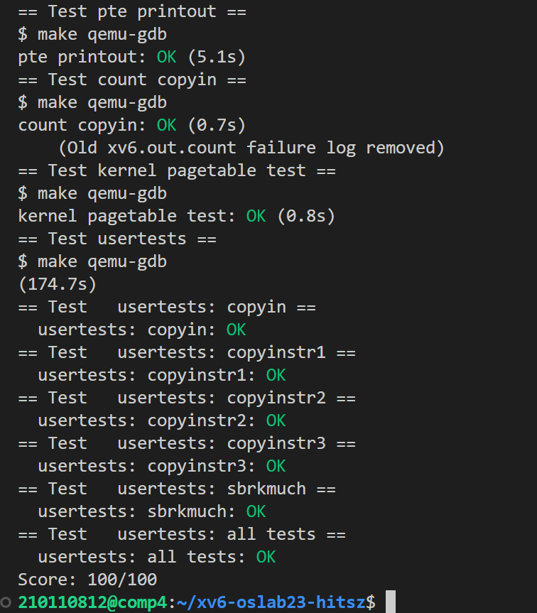

# LAB3：pgtbl

本实验为哈工大（深圳）操作系统课内第四次实验，要求相比于mit-6.S081略有更改，详见[实验指导书](http://hitsz-cslab.gitee.io/os-labs/lab4/part1/)。

> To start the lab, switch to the pgtbl branch
>
> ```c
> $ git fetch
> $ git checkout pgtbl
> $ make clean
> ```

## Print a page table (easy)

任务：实现`vmprint()`函数，实现页表打印功能。打印格式为：

```c
（注意 冒号后面都接一个空格 ）
如果是非叶节点，则为：idx: [索引编号]: pa: [物理地址], flags: [四个权限位(r/w/x/u)]
如果是叶子节点，则为：idx: [索引编号]: va: [虚拟地址] -> pa: [物理地址], flags: [四个权限位(r/w/x/u)]
```

实现思路：采用 **递归** 的算法按层次每页打印即可，需要注意**页表项至虚拟地址的转换**（设置函数参数idx）。

具体实现详见实验报告。

## A kernel page table per process (hard)

任务：将共享内核页表改成**独立内核页表**，使得每个进程拥有自己独立的内核页表。

> #### 独立页表的背景
>
> 共享内核页表中，所有物理地址都和与之完全相等的虚拟地址建立映射，也就是直接映射。这是让内核能够直接以物理地址访问内存的数据，不需要使用任何的虚拟地址。
>
> 但是 ，由于用户地址的映射并未存储于内核页表，如果我们需要处理用户程序传来的虚拟地址（比如系统调用传入的指针），我们需要先找到用户页表，逐个页表项地找到能够翻译对应虚拟地址的页表项后，才可以获取实际的物理地址并进行访问，这叫做**软件模拟翻译**。软件模拟翻译的实现很复杂，同时，因为需要复杂的查找，还降低了性能。
>
> 所以我们将**用户页表中的内存映射**和**原来共享内核页表中的内存映射**进行合并，这样内核也能够直接对用户的虚拟地址进行访问，而不需要软件模拟翻译。需要注意的是，这是任务三和任务二一同需要实现的结果，任务二分离出独立页表，任务三利用独立页表去除软件模拟翻译。

具体实现详见实验报告。

## Simplify (hard)

任务：在独立内核页表加上用户地址空间的映射，同时将函数 `copyin()/copyinstr()` 中的软件模拟地址翻译改成直接访问 ，使得内核能够不必花费大量时间，用软件模拟的方法一步一步遍历页表，而是直接利用硬件。

具体实现详见实验报告。

# 结果截图



