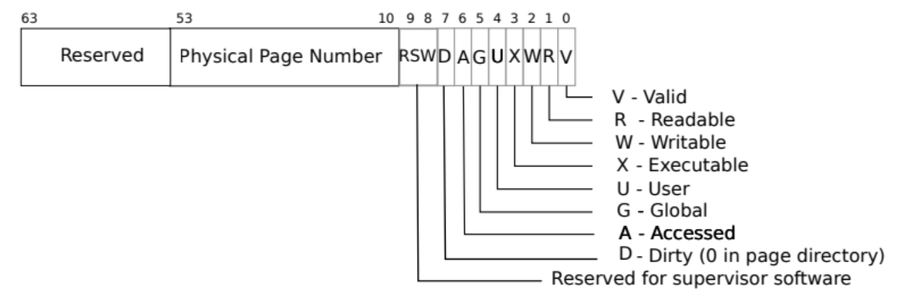
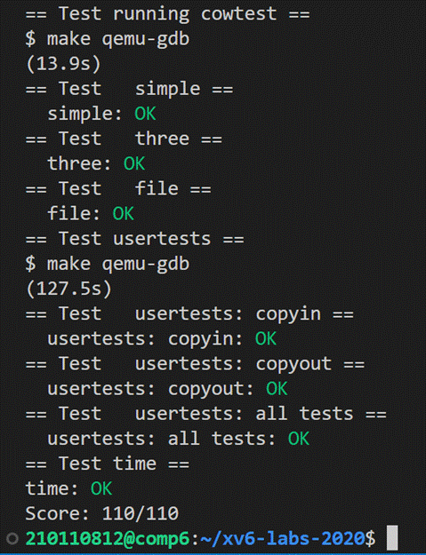

# LAB6：Copy-on-Write Fork for xv6

> To start the lab, switch to the cow branch
>
> ```c
> $ git fetch
> $ git checkout cow
> $ make clean
> ```

在 xv6 系统中，fork() 系统调用会复制父进程的所有用户空间内存给子进程。可是，如果父进程很大，复制过程会消耗很长的时间。更糟糕的是，这可能是无用功，例如 fork() 后子进程紧接着 exec()将导致子进程丢弃复制的内存。另一方面，如果父子进程都要用到这块内存，那么复制又是必须的。

**copy-on-write (COW：写时复制)**很好的解决了这个问题。它只为子进程创建页表，但页表项指向父进程的物理页内存，然后在父子进程页表中标记所有用户页表项 PTE **均为不可写**。当父子进程之一尝试写这些页面时，CPU 将产生缺页异常。内核页面错误处理程序检测到这种情况后，就会给产生异常的进程分配物理内存页，同时复制原始页面进入新页面，并将页表项标记为**可写**。当页面错误处理程序返回 时，用户进程就能够对页面进行写操作了。 

在对写时复制 fork 的进程释放用户态的物理页时需要注意：给定的物理页面可能会被多个进程的页表项所引用，所以应该只在最后一个进程引用结束时释放该物理页。 

本次实验中，我们需要实现该写时复制的功能。

> 在这里我们需要注意一个问题：为什么要将父进程也设置为**不可写**？
>
> 这是因为**我们要保持父进程与子进程的隔离性**，那么父进程如果可以直接写这个物理页，那么子进程就可以看见了父进程的数据了，这是不允许的。

> ##### **hints**
>
> - 修改 uvmcopy() ，使子进程的页表映射到父进程的物理内存，并清除写权限
> - 修改usertrap()，识别cow的页面错误， 为引起cow页面错误的进程分配复制页表以及物理内存，将原页面写权限解锁
> - 确保物理内存在没有引用的情况下才被释放。可以用一个数组保存引用计数，用物理地址/PGSIZTE来区分不同的物理页
> - 修改copyout()来处理在内核中遇到 cow 页面错误的情况
> - 使用标志位来记录PTE是否为cow页面，可使用RSW区域

## Implement copy-on-write

1. RISC-V 的 PTE 有 10 个标志位（如下图），其中第 8、9 位是为用户保留的，因此我们选择第 8 位作为 PTE_COW 的标志位，表示该 PTE 是否需要 copy-on-write。

   

    在kernel/riscv.h中增加`#define PTE_COW (1L << 8)`定义如下：

   ```c
   #define PTE_V (1L << 0) // valid
   #define PTE_R (1L << 1)
   #define PTE_W (1L << 2)
   #define PTE_X (1L << 3)
   #define PTE_U (1L << 4) // 1 -> user can access
   #define PTE_COW (1L << 8)// copy-on-write
   ```

2.  在fork() 代码中，页表复制是由 uvmcopy() 函数实现的，因此我们需要修改 kernel/vm.c中的uvmcopy()函数。根据第1点提示，我们将开辟内存并复制内容的代码删除，改为直接向原空间建立映射（修改父进程的权限后，子进程直接进行映射，即可获得和父进程相同的权限），并把 PTE_W 置零、 PTE_COW 置一。上述操作结束后，将该物理页的引用次数加一。

   ```c
   int
   uvmcopy(pagetable_t old, pagetable_t new, uint64 sz)
   {
     pte_t *pte;
     uint64 pa, i;
     uint flags;
   
     for(i = 0; i < sz; i += PGSIZE){
       if((pte = walk(old, i, 0)) == 0)
         panic("uvmcopy: pte should exist");
       if((*pte & PTE_V) == 0)
         panic("uvmcopy: page not present");
       
       *pte = ((*pte) & (~PTE_W)) | PTE_COW;   // 将页面设置为不可写，并标志为写时复制页
       pa = PTE2PA(*pte);
       flags = PTE_FLAGS(*pte);
   
       // 将父进程的物理页映射到子进程页表项中
       if(mappages(new, i, PGSIZE, pa, flags) != 0){
         goto err;
       }
         
       // 物理页引用次数加一
       add_ref((void*)pa);
     }
     return 0;
   }
   ```

   为了实现物理页引用次数加一的操作，我们需要设置一个计数器，对每一个页面统计有多少个进程指向了它。在此，我们采用数组的形式在kernel/kalloc.c中实现，如下所示：

   ```c
   // 物理地址p对应的物理页号
   #define PAGE_INDEX(p) (((p)-KERNBASE)/PGSIZE)
   
   // 从KERNBASE开始到PHYSTOP之间的每个物理页的引用计数（数组）
   int cowcount[PAGE_INDEX(PHYSTOP)]; 
   
   // 通过物理地址获得引用计数
   #define PA_COUNT(p) cowcount[PAGE_INDEX((uint64)(p))]
   ```

   并设置用于cowcount数组的锁，防止竞态竞争导致的内存泄露。

   ```c
   struct spinlock cowlock;
   ```

   接着，我们实现add_ref函数如下：

   ```c
   void
   add_ref(void *pa)
   {
     if(((uint64)pa % PGSIZE) != 0 || (uint64)pa < KERNBASE || (uint64)pa >= PHYSTOP)
       panic("add_ref");
   
     acquire(&cowlock);
     PA_COUNT(pa)++;
     release(&cowlock);
   }
   ```

3. 对于某个带有 PTE_COW 标记的 PTE 指向的页面，我们写时会引起缺页异常——因为该页面的 PTE_W 被置零了。和上一个实验（lazy allocation）一样，这个缺页异常在 kernel/trap.c中的usertrap 函数里处理。当写页面发生异常时，scause 寄存器的值会被置为 15，stval 寄存器会存储导致异常的地址，所以我们在kernel/trap.c中的usertrap函数中加入判断语句处理`scause==15`的情况（`scause==13`的情况无需判断，因为13是页面读错误，而COW不会引起读错误）。

   ```c
   ......
   } else if((which_dev = devintr()) != 0){
       // ok
   } else if(r_scause() == 15 && checkcowpage(r_stval())){   // 如果是写时复制导致缺页异常
       if(allocatecow(r_stval()) == -1){         // 给该页表项分配物理内存
           p->killed = 1;                        // 如果内存不足，则杀死进程
       }
   } else {
       printf("usertrap(): unexpected scause %p pid=%d\n", r_scause(), p->pid);
       printf("            sepc=%p stval=%p\n", r_sepc(), r_stval());
       p->killed = 1;
   }
   ......
   ```

   需要注意的是，在判断缺页异常时，需要同时判断该异常是否为写时复制导致的。判断逻辑很简单：即获取虚拟地址对应的页表项，并判断在该页表项存在、有效且地址合理的情况下是否被标志为写时复制页。

   ```c
   int 
   checkcowpage(uint64 va) {
     pte_t *pte;
     struct proc *p = myproc();
     
     return va < p->sz                             // 该虚拟地址在进程申请的内存范围内
       && ((pte = walk(p->pagetable, va, 0))!=0)   // 该页表项存在
       && (*pte & PTE_V)                           // 该页表项有效
       && (*pte & PTE_COW);                        // 该页表项被标志为写时复制页
   }
   ```

   allocatecow函数是对copy-on-write的处理 ：它先解析虚拟地址，如果发现其某页表项的的 PTE_COW 被置为一，则为该页分配独立内存并把原数据复制过去，同时把 PTE_W置一、PTE_COW 置零。这样，当我们返回用户空间时，用户进程就能正常执行了。

   ```c
   int 
   allocatecow(uint64 va) {
     pte_t *pte;
     struct proc *p = myproc();
   
     // 通过页表获取虚拟地址对应的页表项
     if((pte = walk(p->pagetable, va, 0)) == 0)
       panic("allocatecow: walk");
   
     uint64 pa = PTE2PA(*pte);
     // 为一个写时复制页分配独立内存，并拷贝数据
     uint64 mem = (uint64)cowcopy((void*)pa); 
     if(mem == 0)
       return -1;
     
     // 重新映射为可写，并清除 PTE_COW 标记
     uint64 flags = (PTE_FLAGS(*pte) | PTE_W) & ~PTE_COW;
     // 取消之前的映射
     uvmunmap(p->pagetable, PGROUNDDOWN(va), 1, 0);
     // 建立新的映射
     if(mappages(p->pagetable, va, 1, mem, flags) == -1) {
       panic("allocatecow: mappages");
     }
     return 0;
   }
   ```

   上述 cowcopy 函数定义在 kernel/kalloc.c 中。当该物理地址的被引用次数减至小于等于 1 时，直接返回该地址，无需复制。否则调用 kalloc 函数分配独立的内存页，并调用 memmove 函数进行复制。复制结束之后，将原物理页的引用次数减一。在整个过程中， 为避免多线程并发造成 cow_count 数组被错误修改，需要给整个过程上锁。

   ```c
   void *
   cowcopy(void *pa) {
     acquire(&cowlock);
   
     // 当引用已经小于等于1时，不创建和复制到新的物理页，而是直接返回该页本身
     if(PA_COUNT(pa) <= 1) { 
       release(&cowlock);
       return pa;
     }
   
     // 分配新的内存页，并复制旧页中的数据到新页
     uint64 newpa = (uint64)kalloc();
     if(newpa == 0) {
       release(&cowlock);
       return 0; 
     }
     memmove((void*)newpa, (void*)pa, PGSIZE);
   
     // 旧页的引用减 1
     PA_COUNT(pa)--;
   
     release(&cowlock);
     return (void*)newpa;
   }
   ```

   以上就是大体的逻辑：**在 fork 的时候不复制数据只建立映射及标记，在进程尝试写入的时候进行复制并重新映射为可写**。接下来，还需要做页的生命周期管理，确保在所有进程都不使用一个页时才将其释放。

4. 在 kernel/kalloc.c 中，我们需要定义一系列的新函数，用于完成在支持懒复制的条件下的物理页生命周期管理。因为一个物理页有可能同时有多个进程的虚拟页指向它，且必须在最后一个进程引用结束时释放该物理页，因此我们需要支持以下操作：

   - kalloc()：分配物理页，将其引用计数初始化为 1

   - add_ref()：创建物理页的一个新引用，引用计数加 1（已在1中实现）

   - cowcopy()：将物理页的一个引用复制到一个新物理页上（引用计数为 1），返回得到的新物理页；并将本物理页的引用计数减 1（已在2中实现）

   - kfree()：释放物理页的一个引用，引用计数减 1；如果计数变为 0，则回收物理页。

   > 一个物理页 p 首先会被父进程使用 kalloc() 创建，fork 的时候，新创建的子进程会使用 add_ref() 声明自己对父进程物理页的引用。当尝试修改父进程或子进程中的页时，cowcopy()将想要修改的页复制到独立的物理页中，并解除旧的物理页的引用（引用计数减 1）。最后 kfree() 保证只有在所有的引用者都释放该物理页的引用时，才释放回收该物理页。

   下面我们对kalloc（分配物理页）和kfree（回收物理页）进行修改：

   ```c
   void *
   kalloc(void)
   {
     ...
     if(r)
       memset((char*)r, 5, PGSIZE); // fill with junk
       PA_COUNT(r) = 1;;            // 将该物理页的引用次数初始化为1
     ...
   }
   ```

   ```c
   void
   kfree(void *pa)
   {
     struct run *r;
   
     if(((uint64)pa % PGSIZE) != 0 || (char*)pa < end || (uint64)pa >= PHYSTOP)
       panic("kfree");
   
     acquire(&cowlock);
   
     // cow_count减到零，释放内存
     if(--PA_COUNT(pa)<=0){
       memset(pa, 1, PGSIZE);
       r = (struct run*)pa;
       acquire(&kmem.lock);
       r->next = kmem.freelist;
       kmem.freelist = r;
       release(&kmem.lock);
     }
   
     release(&cowlock);
   
   }
   ```

   并在kinit()函数中初始化自旋锁。
   ```c
   void
   kinit()
   {
     initlock(&kmem.lock, "kmem");
     initlock(&cowlock, "cow");
     freerange(end, (void*)PHYSTOP);
   }
   ```
   

5. 当这里为止，我们已经可以通过很多测试，但实验手册提示我们修改 **copyout**函数。因为在呼叫**copyout**时，我们处于内核态，并不会触发**usertrap**，所以我们需要手动添加同样的监测代码，检测接收的页是否是共享COW页，若是，要额外进行复制操作。

   ```c
   int
   copyout(pagetable_t pagetable, uint64 dstva, char *src, uint64 len)
   {
     uint64 n, va0, pa0;
   
     while(len > 0){
       if(checkcowpage(dstva)) // 检查每一个被写的页是否是COW页
         allocatecow(dstva);
         
       va0 = PGROUNDDOWN(dstva);
       pa0 = walkaddr(pagetable, va0);
       ......
   }
   ```

# 结果截图

