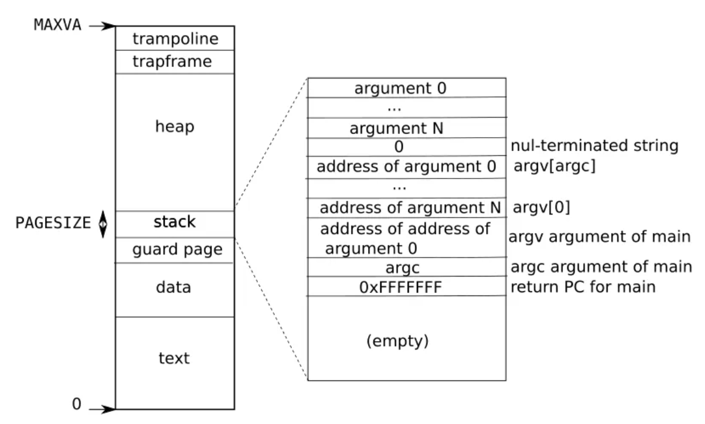
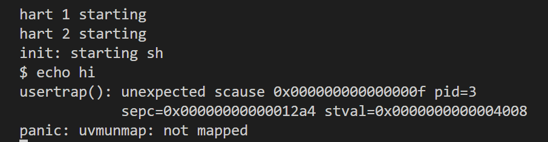
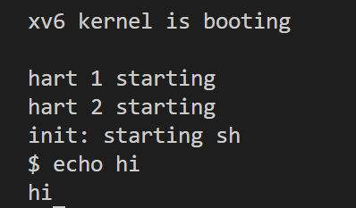
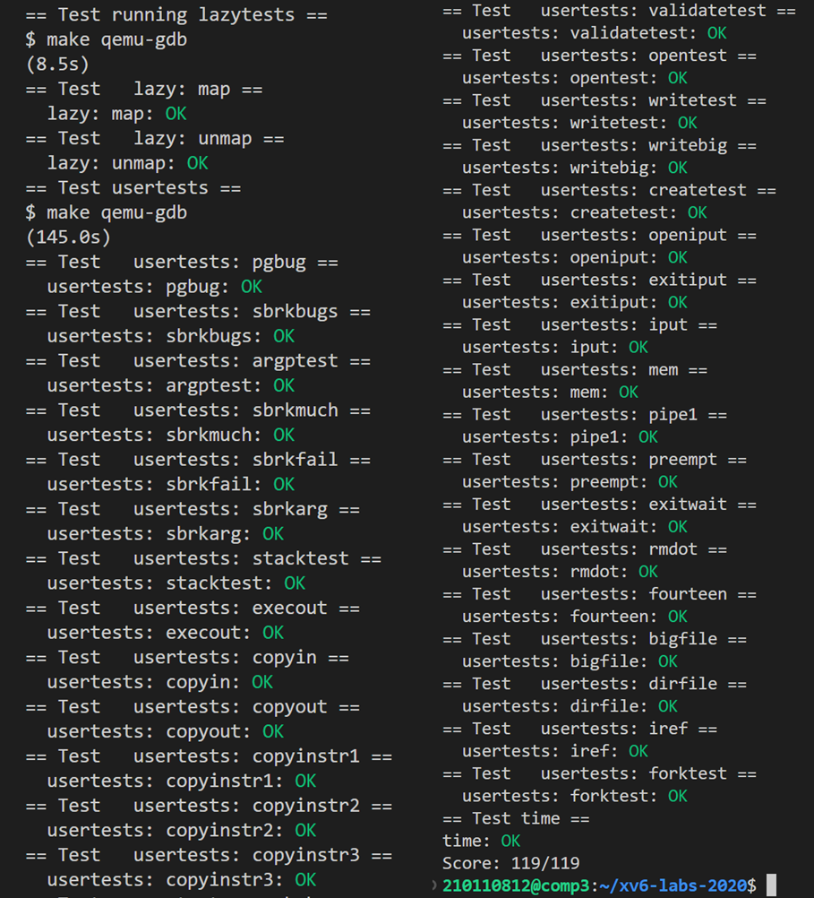

# LAB5：lazy page allocation

> To start the lab, switch to the lazy branch
>
> ```
>  $ git fetch
>  $ git checkout lazy
>  $ make clean
> ```

写在前面：

- 进程在申请内存时，我们很难精确地知道所需要的内存多大，因此，进程会倾向于申请多于所需要的内存。这样会导致一个问题：**有些内存可能一直不会使用，申请了很多内存但是使用的很少**。 lazy page allocation就是解决这样一个问题。解决方法是：**分配内存时，只增大进程的内存空间字段值，但并不实际进行内存分配；当该内存段需要使用时，会抛出 page fault interrupt（缺页中断），这时再进行物理内存的分配，然后重新执行指令**。

- 进程的地址空间是连续的，从 0 开始到 MAXVA，如下图所示：

  

  进程创建时，首先为可执行程序分配代码段（text）和数据段（data），然后分配一个无效的页 **guard page** 用于防止栈溢出。接下来分配进程用户空间栈，**xv6 栈的大小是4096**，刚好对应一页内存。值得注意的是，栈的生长方向是向下的，sp 是栈指针，初始时指向栈底，即大的地址位置。**在栈生长时，栈指针（sp）减小**。**栈的上面是堆（heap），堆的大小是动态分配的，进程初始化时，堆大小为 0，p->sz 指针指向栈底位置**。


## Eliminate allocation from sbrk (easy)

任务：在 kernel/sysproc.c的sys_sbrk函数中修改 xv6 原本的 sbrk(n) 系统调用的实现。原本的 sbrk(n) 会让用户空间增长 n 个字节，返回新分配虚拟空间的首地址（即原用户空间大小）。新的 sbrk(n) 应该只给 `myproc()->sz` 加上 n，返回原用户空间大小，但是并没有实际开辟物理内存。

修改如下：

```c
uint64
sys_sbrk(void)
{
  int addr;
  int n;

  if(argint(0, &n) < 0)
    return -1;
  addr = myproc()->sz;
  if(n < 0) {
    // 如果缩小空间，则立刻释放
    myproc()->sz = uvmdealloc(myproc()->pagetable, addr, addr + n);
  } else {
    // 懒分配：只修改地址空间大小但不分配内存
    myproc()->sz += n;
  }
  
  return addr;
}
```

此时，在 xv6 中执行 echo hi 指令会显示如下结果：



panic 显示出现 `uvmunmap: not mapped `错误，这是由于 uvmunmap 函数在释放内存时，发现内存页无效。因为此时我们只是修改了 sz，并未将分配的用户地址进行标记，也并未真正分配物理内存。`stval=0x0..04008`表示导致页面错误的虚拟地址是 0x4008。

## Lazy allocation (moderate)

任务：改变 trap.c 的代码以回应用户空间的缺页错误，即新开辟一页的物理内存空间，返回用户空间继续执行

这个任务即真正实现Lazy allocation：当系统发生缺页异常时，就会进入到`usertrap`函数中，此时`scause`寄存器保存的是异常原因（13为page load fault，15为page write fault），`stval`是引发缺页异常的地址

1. 在 kernel/trap.c 中的 usertrap 函数中，如果`scause`为13或15，就读取`stval`获取引发异常的地址，之后调用`lazy_allocate`对该地址的页面进行分配。在`lazy_allocate`函数中，首先判断地址是否合法。如果出现的缺页异常是懒分配导致的，则通过`PGROUNDDOWN`宏获取对应页面的起始地址，然后调用`kalloc`分配页面，`memset`将页面内容置0，最后调用`mappages`将页面映射到页表中去。

   ```c
   } else if((which_dev = devintr()) != 0){
       // ok
   } else if(r_scause() == 13 || r_scause() == 15){    // 出现缺页异常
       // 获取错误页面地址
       uint64 addr = r_stval();
       // 判断是否是懒分配引起的（如果是，则错误的地址在 p->sz 内）
       if(lazy_allocate(addr)<0){
           p->killed = 1;
       }
   } else{
       printf("usertrap(): unexpected scause %p pid=%d\n", r_scause(), p->pid);
       printf("            sepc=%p stval=%p\n", r_sepc(), r_stval());
       p->killed = 1;
   }
   ```

   在kernel/proc.c中定义lazy_allocate函数：

   ```c
   int
   lazy_allocate(uint64 va){
     struct proc *p = myproc();
     // 判断是否是懒分配引起的
     if(va >= p->sz || va < p->trapframe->sp)
       return -1;
     // 分配物理内存
     char *mem = kalloc();
     // 内存分配失败
     if(mem == 0)
       return -1;
     // 分配新的内存块之前，使用memset函数将其初始化为0
     memset(mem, 0, PGSIZE);
     // 建立映射：将一个物理内存页面映射到指定进程的虚拟地址空间中
     if(mappages(p->pagetable, PGROUNDDOWN(va), PGSIZE, (uint64)mem, PTE_W|PTE_X|PTE_R|PTE_U) != 0){
       kfree(mem);
       return -1;
     }
     return 0;
   }
   ```

2. 更改 kernel/vm.c中uvmunmap 函数的内容。因为加入懒分配之后，uvmunmap 可能会被要求解除本就不存在的映射、或者去找还没有创建的pte，这样将会 panic。

   > `walk` 函数用于在给定的页表中查找指定虚拟地址对应的页表项

   ```c
   void
   uvmunmap(pagetable_t pagetable, uint64 va, uint64 npages, int do_free)
   {
     ...
       if((pte = walk(pagetable, a, 0)) == 0)	// 页表项不存在
         continue; 
       if((*pte & PTE_V) == 0)	//页表项无效
         continue; 
     ...
   }
   ```

   此时， xv6 中的` echo hi `指令可正常执行：

   

## Lazytests and Usertests (moderate)

任务：完善初级版本的**lazy allocation**的各项功能，解决以下问题：

- 处理负的 sbrk() 参数
- 如果导致缺页错误的虚拟地址高于任何 sbrk() 分配的内存地址，则杀死进程
- 在 fork() 中正确处理父进程到子进程的内存复制
- 处理以下情况：一个进程给系统调用（如 read / write）传入了一个合法的地址，但是地址的内存还没有分配
- 正确处理超出内存的情况：如果 kalloc() 在缺页错误处理中失败了，则杀死进程
- 处理缺页错误中访问用户栈之下的非法空间

1. 对于第一点，即在`sys_sbrk`函数中的`if(n < 0)`部分调用`uvmdealloc`取消分配，在任务一的写法中已经实现。
2. 对于第二、五、六点，只需加入`p-> killed =1`即可，在任务二中已经完成。

3. 对于第三点，`fork`函数通过`uvmcopy`进行地址空间的拷贝（将父进程的页表以及内存拷贝到子进程），我们只要将页表项不存在或者页表项无效时的`panic`的部分改为`continue`即可。

   ```c
   int
   uvmcopy(pagetable_t old, pagetable_t new, uint64 sz)
   {
     ...
     for(i = 0; i < sz; i += PGSIZE){
       if((pte = walk(old, i, 0)) == 0)
         continue; // panic("uvmcopy: pte should exist");
       if((*pte & PTE_V) == 0)
         continue; // panic("uvmcopy: page not present");
     ...
   }
   ```

4. 对于第四点，当进程通过`read`或`write`等系统调用访问未分配页面的地址时，并不会通过页表硬件来访问，也就是说不会发生缺页异常（在内核中访问用户地址空间出现异常不会进入usertrap函数）；在内核态时是通过`walkaddr`来访问用户页表的，因此在这里要对缺页的情况进行处理。当出现`pte == 0 || (*pte & PTE_V) == 0`时，就说明发生了缺页，这时只要调用`lazy_allocate`进行分配，之后再次使用`walk`就能正确得到页表项了。

   ```c
   uint64
   walkaddr(pagetable_t pagetable, uint64 va)
   {
     ...
     pte = walk(pagetable, va, 0);
     if(pte == 0 || (*pte & PTE_V) == 0){
       if(lazy_allocate(va) != 0)
         return 0;
       pte = walk(pagetable, va, 0);
     }
     ...
   }
   ```

# 结果截图

