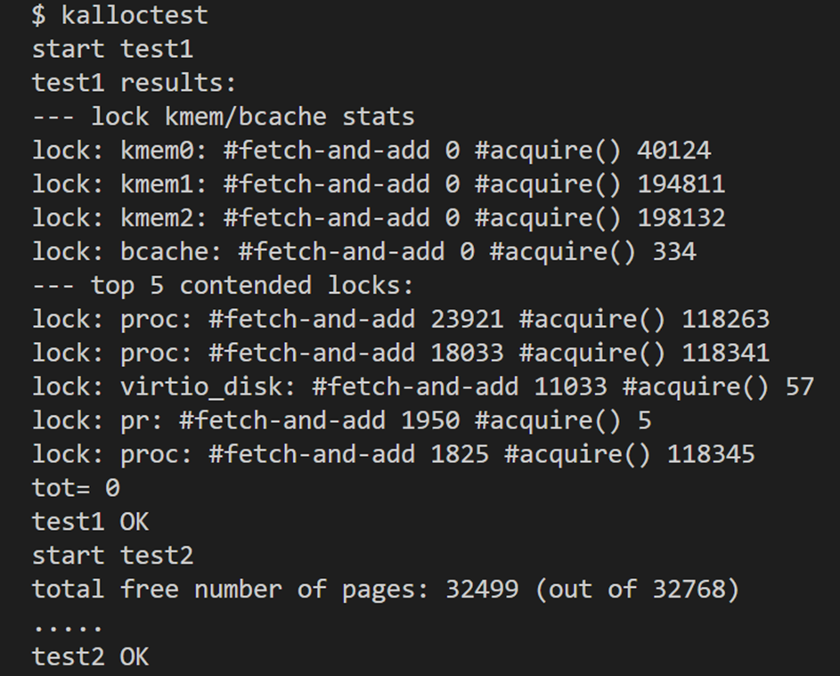
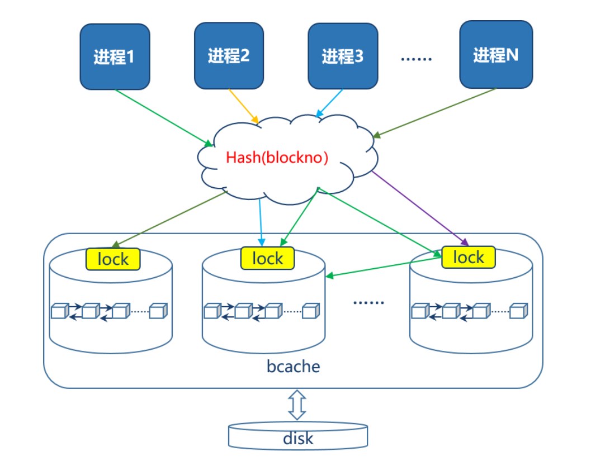
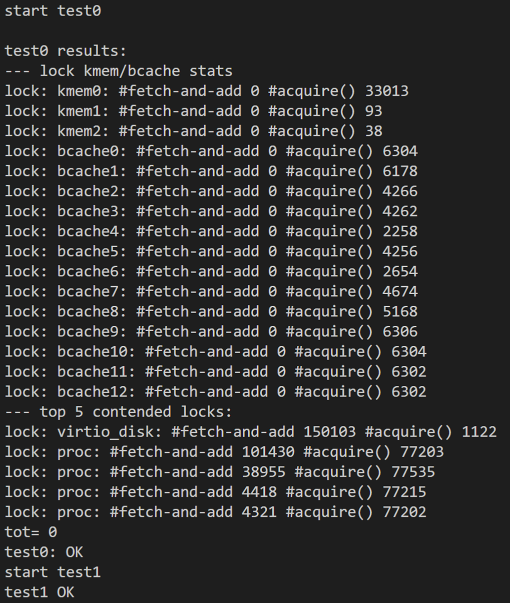
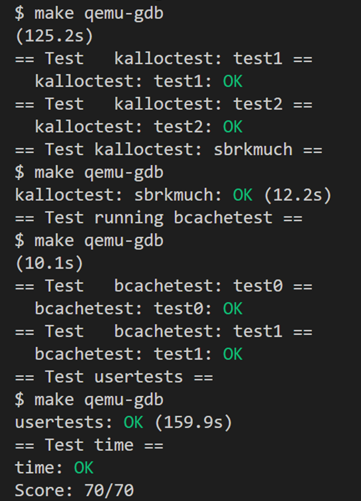

# LAB8: locks

本实验为哈工大（深圳）操作系统课内第三次实验，要求相比于mit-6.S081略有更改，详见[实验指导书](http://hitsz-cslab.gitee.io/os-labs/lab3/part1/)。

> To start the lab, switch to the lock branch
>
> ```c
> $ git fetch
> $ git checkout lock
> $ make clean
> ```

## Memory allocator (moderate)

任务：**修改内存分配器（主要修改kernel/kalloc.c）**，使每个CPU核使用独立的内存链表，而非共享链表。

XV6的内存分配器只有一个内存链表供多个CPU核使用。在使用`kalloc()`获取内存时，由于添加了内存锁`kmem.lock`，其他CPU如果要切换进行内存申请必须等待当前进程释放内存锁。要消除锁争用的情况，需要重新设计内存链表管理机制以避免单个锁和单个链表。实验基本任务是让每个CPU拥有自己的内存链表，每个链表都有自己的锁。其中最具挑战的就是，当一个CPU内存链表不足时，还可以从其他链表 **窃取** 内存块，这样就不会让所有的CPU争抢一个空闲区域（窃取可能会引发锁争用，但这也是不可避免的情况）。

具体实现详见实验报告。

测试结果截图如下：



## Buffer cache (hard)

任务：在访问文件数据的时候，操作系统会将文件的数据放置在磁盘缓存中。磁盘缓存是不同进程之间的共享资源，因此需要通过锁确保使用的正确性。如果有多进程密集地使用文件系统，他们可能会竞争磁盘缓存的`bcache.lock`锁。目前，xv6采用单个锁来管理磁盘缓存。假设有三个进程大量读写磁盘，而由于磁盘缓存只有一个`bcache.lock`锁，这就导致三个进程的竞争异常激烈。因此，我们需要 **修改磁盘缓存块列表的管理机制（主要修改kernel/bio.c）** ，使得可用多个锁管理缓存块，从而减少缓存块管理的锁争用。

> MIT官方指导书推荐使用 **哈希桶** 和 **时间戳** 两个方案，在此我选择的方法是哈希桶。实现逻辑大致为：将各块块号blockno的某种散列值作为key对块进行分组，并为每个哈希桶分配一个专用的锁。通过哈希桶来代替链表，当要获取和释放缓存块时，只需要对某个哈希桶进行加锁，桶之间的操作就可以并行进行，以此提供并行性能。其实现原理示意图如下：
>
> 
>
> Hash 函数是最简单的**直接取模**：
>
> ```c
> #define NBUCKETS 13
> uint hash (uint n) {
>   return n % NBUCKETS;
> }
> ```

具体实现详见实验报告。

测试结果截图如下：



# 结果截图

