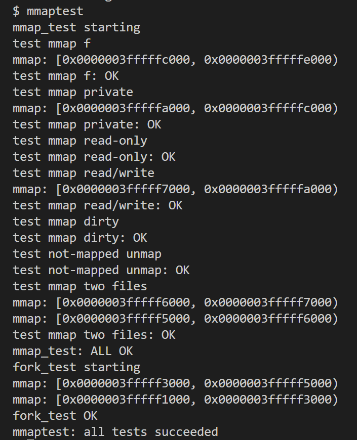

# LAB10: mmap

> To start the lab, switch to the mmap branch
>
> ```c
> $ git fetch
> $ git checkout mmap
> $ make clean
> ```

在本实验中，需要向 xv6 添加` mmap `和` munmap `系统调用。

`mmap`即**内存映射文件**，将一个文件直接映射到内存当中，之后对文件的读写就可以直接通过对内存进行读写来进行，而对文件的同步则由操作系统来负责完成。使用`mmap`可以避免对文件大量`read`和`write`操作带来的内核缓冲区和用户缓冲区之间的频繁的数据拷贝。`munmap `用于删除` mmap `在地址范围内的映射。

`mmap 机制`听上去可能很普通，但需要牢记的一点是：**在 Linux 中万事万物都是 file** 。这样是不是觉得 mmap机制瞬间高大了。

mmap 机制示意图如下：


进程需要在 heap 中为 file 预留一块空闲区域（即图中的灰色mapped区域）；可以将整个 file 都映射到虚拟内存，也可以选择映射部分文件（通过mmap函数中的offset和length参数设置）。

## 添加 mmap 系统调用

1. ` mmap `和` munmap `系统调用声明如下：

   ```c
   void *mmap(void *addr, size_t length, int prot, int flags, int fd, off_t offset);
   /*
   	addr 是映射的地址，当addr为0时，由操作系统来决定最终映射的地址（本实验中addr总是0）；
   	length 是映射的内存长度；
   	prot 是映射对应的权限（read/write）；
   	flags 是映射的类型，分为shared和private，如果是shared，那么最终对文件进行的修改会写回外存；
   	fd 是文件描述符；
   	off 是偏移量（本实验中off总是0）。
   */
   int munmap(void *addr, size_t len);
   /*
   	addr 是映射区域的起始地址
   	len 是映射区域的大小
   */
   ```

2. 由于在使用 mmap 机制时，需要记录下映射区域的一些基本信息。因此，我们在 `kernel/proc.h` 中定义 一个数据结构`struct VMA`，意为虚拟内存区域（ virtual memory area），用于记录 mmap 分配的虚拟内存空间，包括地址、权限等信息。

   > 这里需要注意两点：
   >
   > - `start` 和 `end` 是根据 `addr` 和 `length` 计算出来的**与一页对齐**的 vma 地址范围，因为我们分配内存空间一定是按页分配的。
   > - 每一个进程的 PCB 中记录着它用到的所有 VMA。在此使用**链表**这种数据结构，因此设置`next`指针字段。

   ```c
   #define VMA_SIZE 16
   #define VMA_START (MAXVA / 2)
   struct VMA {	
     uint64 start;   		// 映射虚拟地址的起始地址
     uint64 end;     		// 映射虚拟地址的起始地址
     int prot;				// 权限
     int flags;			// 映射的类型
     int valid;			// 该VMA是否正在被某进程使用中
     struct file *file;	// 指向的文件
     struct VMA *next;		 
   };
   ```

   同时，在 kernel/proc.h 的 proc 结构体中定义进程对应的 VMA 链表和当前已分配分配区域的最低地址（后面会解释）。

   ```c
   struct proc {
     ......
     struct VMA *vma;             // 进程对应的vma链表
     uint64 min_addr;             // 已分配区域的最低地址 
   };
   ```

   根据实验指导书提示，在kernel/param.h中固定定义每个进程的 vma 空槽数量为16。

   ```c
   #define VMA_SIZE     16
   ```

3. 在 kernel/sysfile.c 文件中实现 sys_mmap 系统调用。

   具体逻辑如下：首先从寄存器中获取所有参数，然后判断文件的权限是否正确。如果正确，通过 `vma_alloc()` 函数申请一个`vma`，并填充相应的字段，同时通过 `filedup()` 函数增加该文件的引用计数，最后将`vma`插入到当前进程的`vma`链表中去。

   由于`mmap` 是懒分配的（此概念详见lab5），所以只需返回映射的起始地址即可，无需通过kalloc()函数开辟物理内存。但这里存在几个问题：如何在进程的地址空间中找到一块连续的不用的区域来映射文件？如何确定映射的起始地址？

   查阅 the xv6 book可知 xv6 对用户的地址空间的分配中，heap 的范围一直从 stack 到 trapframe（详见上图）。由于进程本身所使用的内存空间是从低地址向高地址生长的（sbrk 调用），因此，为了尽量使得映射的文件地址空间不和进程所使用的地址空间产生冲突，我们选择将mmap 映射进来的文件放置在尽可能高的位置——也就是刚好在 trapframe 下面。若有多个映射文件则向下生长。这也解释了我们为什么要在每个 PCB 里记录已分配区域的最低地址min_addr，因为每次从最低地址继续往下分配空间可以允许我们从高地址向低地址寻找进程的“不用区域”。

   （:cry: 但其实我试过把映射的开始地址固定在KERNBASE处.....倒是也能通过测试.....）

   ```c
   uint64
   sys_mmap(void)
   {
     // 从寄存器中获取所有参数
     uint64 addr;
     int length, prot, flags, fd, offset;
     if(argaddr(0, &addr) < 0 ||
        argint(1, &length) < 0 ||
        argint(2, &prot) < 0 ||
        argint(3, &flags) < 0 ||
        argint(4, &fd) < 0 ||
        argint(5, &offset) < 0)
       return -1;
     if(addr != 0) panic("sys_mmap");
     if(offset != 0) panic("sys_mmap");
     
     struct proc *p = myproc();
     struct file *f = p->ofile[fd];
   
     // 判断文件权限是否正确
     // 如果文件不可读但请求了读取权限，则权限检查失败
     // 如果文件不可写但请求了写入权限，且没有设置 MAP_PRIVATE 标志，则权限检查失败
     if((prot & PROT_READ) && !f->readable)
       return -1;
     if((prot & PROT_WRITE) && (flags & MAP_SHARED) && !f->writable)
       return -1;
   
     // 分配一个 VMA（虚拟内存区域）结构体并设置属性
     struct VMA* v = vma_alloc();
     if(!v)  return -1;
     // 填充相应字段
     v->prot = ((prot & PROT_READ) ? PTE_R : 0) | ((prot & PROT_WRITE) ? PTE_W : 0);
     v->flags = (flags & MAP_SHARED) ? 1 : 0;
     v->file = f;
     filedup(f);
   
     // 将新申请的vma插入到进程的vma链表中去（头插法）
     v->next = p->vma;
     p->vma = v;
   
     // 在要映射文件的进程的地址空间中找到一个未使用的区域
     uint64 vmaddr = PGROUNDDOWN(p->min_addr - length);
     if(vmaddr % PGSIZE != 0)  panic("sys_mmap");
   
     // 映射地址
     v->start = vmaddr;
     v->end = p->min_addr;
     p->min_addr = vmaddr;
   
     return vmaddr;
   }
   ```

   其中，`vma_alloc`函数实现对`VMA`分配，即遍历查询未被使用的VMA并返回查询到的VMA的地址。在遍历之前需要设置一个 VMA[16] 数组，且由于给多个进程分配`VMA`需要加锁的操作，因此我们将锁和数组定义在同一个结构体`vmalist`中。

   ```c
   struct {  
     struct spinlock lock;
     struct VMA vmas[VMA_SIZE];
   } vmalist;
   
   // 初始化锁
   void
   vmainit(void)
   {
     initlock(&vmalist.lock, "vmalist");
   }
   
   struct VMA*
   vma_alloc(void)
   {
     acquire(&vmalist.lock);
     int i;
     // 遍历查询未被使用的vma
     for(i = 0; i < VMA_SIZE; i++){
       if(vmalist.vmas[i].valid){
         continue;
       } else {
         vmalist.vmas[i].valid = 1;
         break;
       }
     }
     release(&vmalist.lock);
     if(i == VMA_SIZE)   panic("allocvma: no enough vma!");
     return vmalist.vmas + i;
   }
   ```

4. 如前所述，由于`mmap` 是懒分配的，因此我们需要在`usertrap`中对缺页中断进行处理。

   ```c
   else if(r_scause() == 15 || r_scause() == 13){
       // page fault
       if(mmap_handler(r_stval(), r_scause()) != 0){
         printf("page fault\n");
         p->killed = 1;
       }
     }
   ```

   处理的逻辑如下：从当前进程的 VMA 链表中查找指定虚拟地址 `va` 所属的 VMA 区域，然后根据 scause（陷阱原因）和 VMA 区域的权限进行相应的判断。然后为缺页处的分配物理页面，并将文件的内容读入已分配的内存。

   ```c
   int
   mmap_handler(uint64 va, uint64 cause) 
   {
     struct proc *p = myproc();
   
     //循环遍历当前进程的VMA链表，找到包含指定虚拟地址va的VMA区域
     struct VMA* v = p->vma;
     while(v != 0){
       if(v->valid && va >= v->start && va < v->end){
         break;
       }
       v = v->next;
     }
     if(!v)  return -1; // not mmap addr
   
     // 如果发生读取异常，但对应VMA区域的权限不包含可读权限，则返回-1；写入异常同理。
     if(cause == 13 && !(v->prot & PTE_R)){
       printf("cause == 13!\n");
       return -1;
     }
     
     if(cause == 15 && !(v->prot & PTE_W)){
       printf("cause == 15!\n");
       return -1;
     } 
     
     // 分配物理内存页面
     char *mem = kalloc();
     if(mem == 0)  return -1;    // kalloc failed
     memset(mem, 0, PGSIZE);
     
     // 将分配的物理页面映射到指定的虚拟地址，并设置相应的权限
     uint64 va_down = PGROUNDDOWN(va);
     if(mappages(p->pagetable, va_down, PGSIZE, (uint64)mem, v->prot|PTE_U|PTE_X) != 0){
       kfree(mem);
       return -1;
     }
     
     // 将文件的内容读入已分配的内存
     mmapfileread(v->file, 0, (uint64)mem, va_down - v->start, PGSIZE);
     //printf("handler finish!\n");
     
     return 0;
   }
   ```

   其中，`mmapfileread`函数定义在kernel/file.c中。 

   ```c
   int mmapfileread(struct file *f, int user_dst, uint64 dst, uint off, uint n){ 
     ilock(f->ip);
     int ret = readi(f->ip, user_dst, dst, off, n);
     iunlock(f->ip);
     return ret;
   }
   ```

## 添加 munmap 系统调用

`sys_munmap`函数的作用是取消虚拟内存区域的映射，包括更新页表、修改VMA节点、释放资源等操作。

首先，查找当前进程所给地址对应的 VMA，如果VMA是 shared 且具有写权限，则把现在的内容写回文件。然后使用 `unmunmap`函数取消映射指定的页面。最后，根据取消映射的起始地址和长度更新VMA节点的start和end字段：如果释放的只是 vma 区域的一部分，则更新VMA的 `vmstart` 和 `vmend`；如果释放了整个VMA区域，则把它从链表里拿出来、释放（valid 置零）并减少文件的计数引用。

```c
uint64
sys_munmap(void)
{
  uint64 addr;
  int length;

  // 获取函数参数
  if(argaddr(0, &addr) < 0 || argint(1, &length) < 0){
    return -1;
  }

  struct proc *p = myproc();
  struct VMA *v = p->vma;
  struct VMA *pre = 0;

  // 查找映射地址对应的VMA
  uint64 start = PGROUNDDOWN(addr);
  uint64 end = PGROUNDUP(addr + length);
  while(v != 0){
    if(v->valid && start >= v->start && end <= v->end) 
      break; 
    pre = v;
    v = v->next;
  }
  if(!v)  return -1;

  // 如果VMA是shared且具有写权限，则把现在的内容写回文件
  if(v->flags && (v->prot | PTE_W))
    mmapfilewrite(v->file, start, end - start);
  
  // 解除页表的映射
  for(uint64 i = start; i < end; i += PGSIZE){
    if(walkaddr(p->pagetable, i)){
      uvmunmap(p->pagetable, i, 1, 1);
    }
  }
  
  // 根据取消映射的起始地址和长度，更新VMA节点的start和end字段
  if(v->start == start && end < v->end)
    v->start = PGROUNDDOWN(addr + length);
  else if(v->start < start && end == v->end)
    v->end = PGROUNDUP(addr);
  else if(v->start == start && end == v->end){
    if(pre == 0){
      p->vma = v->next;
    } else {
      pre->next = v->next;
      v->next = 0;
    }
    fileclose(v->file);
    vma_dealloc(v);
  }

  return 0;
}
```

其中`mmapfilewrite`函数是一个对` filewrite `函数的一个仿写，xv6 原生的` filewrite `只能从 idx=0 处开始写。

```c
int mmapfilewrite(struct file *f, uint64 addr, uint n){
  int max = ((MAXOPBLOCKS-1-1-2) / 2) * BSIZE;
  int i = 0;
  while(i < n){
    int n1 = n - i;
    if(n1 > max)
      n1 = max;

    begin_op();
    ilock(f->ip);
    int r = writei(f->ip, 1, addr + i, i, n1);
    iunlock(f->ip);
    end_op();

    if(r != n1){
      // error from writei
      break;
    }
    i += r;
  }
  int ret = (i == n ? n : -1);
  return ret;
}
```

## **fork & exit**

添加完系统调用之后，根据xv6的提示，我们修改`fork `以及` exit` 函数。

- 修改`fork`函数，将进程p的VMA链表复制到子进程中，确保两个进程拥有相同的虚拟内存区域。

  ```c
  int
  fork(void)
  {
    ......
    np->vma = 0;
    struct VMA *pv = p->vma;
    struct VMA *pre = 0;
    while(pv){
      struct VMA *vma = vma_alloc();
      vma->start = pv->start;
      vma->end = pv->end;
      vma->prot = pv->prot;
      vma->flags = pv->flags;
      vma->file = pv->file;
      filedup(vma->file);		//增加VMA结构的引用计数
      vma->next = 0;
      if(pre == 0){
        np->vma = vma;
      }else{
        pre->next = vma;
        vma->next = 0;
      }
      pre = vma;
      pv = pv->next;
    }
    ......
  }
  ```

- 修改`exit` 函数，释放该进程的所有VMA。

  ```c
  void
  exit(int status)
  {
    struct proc *p = myproc();
      
    ......
  
    // munmap all mmap vma
    struct VMA *vma = 0; 
    struct VMA *nextvma = 0;
    for(vma = p->vma; vma; vma = nextvma){
      nextvma = vma->next;
      // 扫描当前VMA节点中的所有物理页面，将其从进程p的页表中删除
      for(uint64 i = vma->start; i < vma->end; i += PGSIZE)
        if(walkaddr(p->pagetable, i)){
          uvmunmap(p->pagetable, i, 1, 1);
        }
      vma->next = 0;
      fileclose(vma->file);   // 关闭当前VMA节点关联的文件
      vma_dealloc(vma);       // 释放当前VMA节点所占用的内存空间
    }
    // 链表头置空
    p->vma = 0;
    ......
  }
  ```

最后，进行一些初始化操作：

- 初始化vma锁：

  ```c
  void
  main()
  {
    if(cpuid() == 0){
      ......
      fileinit();      // file table
      vmainit(); 
      ......
    } else {
      ......
    }
  
    scheduler();        
  }
  ```

- 在kernel/proc.c中初始化已分配的最小地址min_addr

  ```c
  // initialize the proc table at boot time.
  void
  procinit(void)
  {
    struct proc *p;
    
    initlock(&pid_lock, "nextpid");
    for(p = proc; p < &proc[NPROC]; p++) {
        initlock(&p->lock, "proc");
        p->kstack = KSTACK((int) (p - proc));
        p->min_addr = MAXVA - 2 * PGSIZE;
    }
  }
  ```

  

# 结果截图

- `mmaptest`（额外打印了映射地址，可以看到确实是向下生长的）：



- `make grade`通过：

