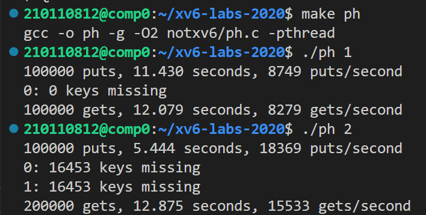

# LAB7: Multithreading

> To start the lab, switch to the thread branch
>
> ```c
> $ git fetch
> $ git checkout thread
> $ make clean
> ```

## Uthread: switching between threads (moderate)

任务：补全 uthread.c，完成用户态线程功能的实现。

1. 首先，借鉴 kernel/proc.h 中的上下文结构体，在 user/uthread.c 中定义一个`context`结构体保存线程上下文，并加入到`thread`结构体中。在上下文中只需要保存被调用者保存的寄存器，即`sp`和`s0-s11`，`ra`用来保存线程的返回地址，类似于进程中的`pc`。

   > 注意，这里涉及到一个很关键的问题：**为什么 thread_switch 只需要保存/恢复 callee-save 寄存器？**
   >
   > - 寄存器被分为两种类型——**caller-save** 和 **callee-save**。从调用者的角度看，caller-save 寄存器在调用前后可能发生变化，而 callee-save 寄存器不会变化 。内核调度器无论是通过时钟中断进入（usertrap），还是线程自己主动放弃 CPU（sleep、exit），最终都会调用到 yield 进一步调用 swtch。 由于上下文切换永远都发生在函数调用的边界（swtch 调用的边界），恢复执行相当于是 swtch 的返回过程，会从堆栈中恢复 caller-saved 的寄存器， 所以用于保存上下文的 context 结构体只需保存 **callee-saved 寄存器，以及返回地址 ra、栈指针 sp** 即可。恢复后执行到哪里是通过 ra 寄存器来决定的（swtch 末尾的 ret 转跳到 ra）
   >
   > - 这里需要与之区分的是 trapframe 。由于一个中断可能在任何地方发生，不仅仅是函数调用边界，也有可能在函数执行中途，所以恢复的时候需要靠 pc 寄存器来定位。 并且由于切换位置不一定是函数调用边界，所以几乎**所有的寄存器都要保存**（无论 caller-saved 还是 callee-saved），才能保证正确的恢复执行。 这也是内核代码中 `struct trapframe` 中保存的寄存器比 `struct context` 多得多的原因。
   >
   >   [推荐知乎上的一篇文章：为什么CPU寄存器要分为两组，被调用者保存寄存器和调用者保存寄存器？（下图为文章的节选）](https://www.zhihu.com/question/301000788)
   >
   > 
   >
   > - 

   ```c
   struct context {
     uint64 ra;
     uint64 sp;
   
     // callee-saved
     uint64 s0;
     uint64 s1;
     uint64 s2;
     uint64 s3;
     uint64 s4;
     uint64 s5;
     uint64 s6;
     uint64 s7;
     uint64 s8;
     uint64 s9;
     uint64 s10;
     uint64 s11;
   };
   
   struct thread {
     char       stack[STACK_SIZE]; /* the thread's stack */
     int        state;             /* FREE, RUNNING, RUNNABLE */
     struct context context;       /* 存储线程上下文切换时保存的寄存器 */
   };
   ```

2. 借鉴 `swtch.S`，在`uthread_switch.S `中需要实现上下文切换的代码。

   ```c
   thread_switch:
   	/* YOUR CODE HERE */
   	sd ra, 0(a0)
   	sd sp, 8(a0)
   	sd s0, 16(a0)
   	sd s1, 24(a0)
   	sd s2, 32(a0)
   	sd s3, 40(a0)
   	sd s4, 48(a0)
   	sd s5, 56(a0)
   	sd s6, 64(a0)
   	sd s7, 72(a0)
   	sd s8, 80(a0)
   	sd s9, 88(a0)
   	sd s10, 96(a0)
   	sd s11, 104(a0)
   
   	ld ra, 0(a1)
   	ld sp, 8(a1)
   	ld s0, 16(a1)
   	ld s1, 24(a1)
   	ld s2, 32(a1)
   	ld s3, 40(a1)
   	ld s4, 48(a1)
   	ld s5, 56(a1)
   	ld s6, 64(a1)
   	ld s7, 72(a1)
   	ld s8, 80(a1)
   	ld s9, 88(a1)
   	ld s10, 96(a1)
   	ld s11, 104(a1)
   
   	ret    /* return to ra */
   ```

   > 下一个问题：**为什么swtch函数要用汇编来实现，而不是C语言？**
   >
   > - C语言中很难与寄存器交互，其中没有方法能更改sp、ra寄存器。所以在普通的C语言中很难完成寄存器的存储和加载，唯一的方法就是在C中嵌套汇编语言（简单来说，swtch函数中的操作是在C语言的层级之下的）。

3. 在kernel/uthread.c中的`thread_schedule` 函数中调用 `thread_switch` 进行上下文切换。

   ```c
   void 
   thread_schedule(void)
   {
     struct thread *t, *next_thread;
     ......
     if (current_thread != next_thread) {         /* switch threads?  */
       next_thread->state = RUNNING;
       t = current_thread;
       current_thread = next_thread;
       thread_switch(&t->context, &next_thread->context);
     } else
       next_thread = 0;
   }
   ```

4. 补充kernel/uthread.c中的 thread_create 函数：将线程函数的入口地址保存到返回地址 ra 中， 使得` thread_switch `最后返回到该地址，从而运行线程代码；将 sp 指向栈底（由于栈从高到低生长，所以 sp 应该指向栈的最高地址）。

   ```c
   void 
   thread_create(void (*func)())
   {
     ......
     t->context.ra = (uint64)func;
     t->context.sp = (uint64)&t->stack + (STACK_SIZE - 1);
   }
   ```

**运行结果如下：**

```c
$ uthread
thread_a started
thread_b started
thread_c started
thread_c 0
thread_a 0
thread_b 0
thread_c 1
thread_a 1
thread_b 1

......

thread_c 98
thread_a 98
thread_b 98
thread_c 99
thread_a 99
thread_b 99
thread_c: exit after 100
thread_a: exit after 100
thread_b: exit after 100
thread_schedule: no runnable threads
```

## Using threads (moderate)

任务：在一台多核 Linux 上使用 UNIX `pthread` 线程库实现多线程的并行程序。

xv6提供了一个代码 notxv6/ph.c，它开给定数量个线程，每个线程向 hash 表里面加许多 key（put 操作），然后从 hash 表里取出 key（get 操作），同时记录 put、get 的用时，以及缺失的 key——本来应该在 hash 表里，但是 get 不到。

在未更改代码之前，我们先分别运行一下`./ph 1`和`./ph 2`，其中ph的参数代表哈希表上执行put和get操作的线程数。我们对比`./ph 1`和`./ph 2`的输出可以发现：当两个线程并发地向哈希表中添加条目时，达到了每秒18369次插入的总速率。这大约是单线程速率的两倍，可见这是一个出色的“并行加速”，也是人们可能希望的（即两倍的内核产生两倍的单位时间的工作）。但同时，我们也可以发现两个线程的并发执行导致了16453个键的缺少，表明大量本应在哈希表中的键不在哈希表中。



我们举个[例子](https://juejin.cn/post/7016228101717753886)来说明为什么多线程会导致键的缺失：

```c
[假设键 k1、k2 属于同个 bucket] 

thread 1: 尝试设置 k1
thread 1: 发现 k1 不存在，尝试在 bucket 末尾插入k1
--- scheduler 切换到 thread 2
thread 2: 尝试设置 k2
thread 2: 发现 k2 不存在，尝试在 bucket 末尾插入 k2
thread 2: 分配 entry，在桶末尾插入 k2
--- scheduler 切换回 thread 1
thread 1: 分配 entry，没有意识到 k2 的存在，在其认为的 “桶末尾”（实际为 k2 所处位置）插入 k1 

[k1 被插入，但是由于被 k1 覆盖，k2 从桶中消失了，引发了键值丢失]
```

由此可知，发生缺失的原因是 ph.c 没有在多线程时加锁，这个实验的任务就是对哈希桶进行加锁操作。

该任务提供的接口如下：

```c
pthread_mutex_t lock;            // declare a lock
pthread_mutex_init(&lock, NULL); // initialize the lock
pthread_mutex_lock(&lock);       // acquire lock
pthread_mutex_unlock(&lock);     // release lock
```

1. 我们先考虑一种最容易想到的情形：

   ```c
   // ph.c
   pthread_mutex_t lock;
   
   int
   main(int argc, char *argv[])
   {
     pthread_t *tha;
     void *value;
     double t1, t0;
     
     pthread_mutex_init(&lock, NULL);
   	
     ......
   }
   
   static 
   void put(int key, int value)
   {
     NBUCKET;
   
     pthread_mutex_lock(&lock);
     
     ......
   
     pthread_mutex_unlock(&lock);
   }
   
   static struct entry*
   get(int key)
   {
     NBUCKET;
   
     pthread_mutex_lock(&lock);
     
     ......
   
     pthread_mutex_unlock(&lock);
   
     return e;
   }
   ```

   结果如下：

   

   显而易见的是，多线程执行的版本不再存在缺失键的情况，说明加锁成功防止了 race-condition 的出现。但同时也可以发现，加锁后多线程的性能变得比单线程还要低。这与我们的初衷相违背：虽然不会出现数据丢失，但是失去了多线程并行计算的意义——提升性能。

   性能降低的原因很简单：由于我们为整个操作加上了互斥锁，意味着每一时刻只能有一个线程在操作哈希表，这实际上等同于将哈希表的操作变回单线程，又由于锁操作（加锁、解锁、锁竞争）存在开销，因此产生了性能甚至不如单线程的情况。

2. 多线程效率的一个常见的优化思路是**降低锁的粒度**。由于哈希表中，不同的 bucket 是互不影响的，一个 bucket 处于修改未完全的状态并不影响 put 和 get 对其他 bucket 的操作，所以实际上只需要确保两个线程不会同时操作同一个 bucket 即可，并不需要确保不会同时操作整个哈希表。因此，我们将整个哈希表一个互斥锁修改为**每个哈希桶一个互斥锁**，实现如下：

   ```c
   // ph.c
   pthread_mutex_t lock[NBUCKET]; // 定义锁
   
   static 
   void put(int key, int value)
   {
     int i = key % NBUCKET;
     pthread_mutex_lock(&lock[i]);
     ......
     pthread_mutex_unlock(&lock[i]);
   }
   
   static struct entry*
   get(int key)
   {
     int i = key % NBUCKET;
     pthread_mutex_lock(&lock[i]);
     ......
     pthread_mutex_unlock(&lock[i]);
     return e;
   }
   
   int
   main(int argc, char *argv[])
   {
     ...
     // 初始化锁
     for (int i = 0; i < NBUCKET; i++) {
       pthread_mutex_init(&lock[i], NULL);
     }
     ...
   }
   ```

   最终结果如下：

   

   虽然由于锁开销，上述结果依然达不到理想的`单线程速度 * 线程数`的速度，但多线程版本的性能相比之前有了显著提升，且不存在缺失的键。

## Barrier(moderate)

任务：实现**同步屏障机制**——执行到这里的线程必须等待，直到所有线程都执行到了这个地方。

相关接口如下：

```c
pthread_cond_wait(&cond, &mutex);  // go to sleep on cond, releasing lock mutex, acquiring upon wake up
pthread_cond_broadcast(&cond);     // wake up every thread sleeping on cond
```

整体的实现逻辑很简单：加锁，然后判断到达屏障点的线程数，如果所有线程都已到达就调用`pthread_cond_broadcast`唤醒其他线程，否则就调用`pthread_cond_wait`进行等待。实现代码如下：

```c
static void 
barrier()
{
  pthread_mutex_lock(&bstate.barrier_mutex);
  bstate.nthread++;
  if(bstate.nthread < nthread){
    // 如果未达到总线程数，则睡眠，等待其他线程到来。
    pthread_cond_wait(&bstate.barrier_cond, &bstate.barrier_mutex);
  } else {
    // 如果达到总线程数，则唤醒所有等待的线程。
    pthread_cond_broadcast(&bstate.barrier_cond);
    // 屏障轮数加一
    bstate.round++;
    // 计数器清零，此时没有再等待的线程
    bstate.nthread = 0;
  }
  pthread_mutex_unlock(&bstate.barrier_mutex);
}
```

> 「将已进入屏障的线程数量增加 1，然后再判断是否已经达到总线程数」这一步并不是原子操作，并且这一步和后面的两种情况中的操作「睡眠」和「唤醒」之间也不是原子的，如果在这里发生 race-condition，则会导致出现 「lost wake-up 问题」
>
> - 举个例子：线程 1 即将睡眠前，线程 2 调用了唤醒，然后线程 1 才进入睡眠，将会导致线程 1 本该被唤醒而没被唤醒

# 结果截图

